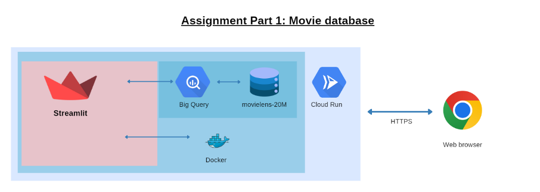

# Cloud & Advanced Analytics 2025
## Assignment 1

### Goal
You will implement a simple interface that interacts with a BigQuery cloud database. The application should run on the Google Cloud. The learning goals for the assignment is to familiarize yourself with Docker, Google Cloud, SQL and external APIs.

### Details
In this assignment, you will implement a web application that will issue queries on a movie database. You can search titles of movies and also issue more advanced search functionalities. The advanced search functionality will allow users to specify filters to refine their search results. For instance, a user may want to find all the movies from Germany that are in the comedy genre and were released in 2019. 

### Tasks
Upload the movies and the user ratings datasets in BigQuery in the proper tables. You can find these datasets in the following zip file:
- [**assignment1-data.zip**](https://unils-my.sharepoint.com/:u:/g/personal/dimitri_roulin_unil_ch/EUB9EaTsDddIqKBs7xosJZcBsea800PmN2FFDjxF7Q923g?e=qN3O5D)

Here’s a preview of how the movies and the rating tables look like respectively:

#### Movies Table
| movieId | title               | genres                   | tmdbId | language | release_year | country                  |
|---------|---------------------|--------------------------|--------|----------|--------------|--------------------------|
| 1502    | Kissed (1996)       | Drama\|Romance           | 21626  | en       | 1996         | Canada                   |
| 4665    | Shocker (1989)      | Horror                   | 12521  | en       | 1989         | United States of America |
| 3686    | Flatliners (1990)   | Horror\|Sci-Fi\|Thriller  | 1551   | en       | 1990         | United States of America |
| 114062  | Motel Life, The (2012) | Drama\|Mystery\|Thriller | 80318  | en       | 2013         | United States of America |
| 129786  | Dhobi Ghat (2011)   | Drama                    | 54890  | hi       | 2010         | India                    |

#### Ratings Table
|        | userId | movieId | rating | timestamp   |
|--------|--------|---------|--------|------------|
| **0**  | 1      | 2       | 3.5    | 1112486027 |
| **1**  | 1      | 29      | 3.5    | 1112484676 |
| **2**  | 1      | 32      | 3.5    | 1112484819 |
| **3**  | 1      | 47      | 3.5    | 1112484727 |
| **4**  | 1      | 50      | 3.5    | 1112484580 |

### Features to implement:

- **Title autocomplete (SQL):** assist users in exploring movie titles as they type.
- **Language filter (SQL):** allow filtering movies by language.
- **Genre filter (SQL):** allow filtering movies by genre.
- **Average rating filter (SQL):** retrieve movies with an average rating above a given threshold (e.g. > 4.0), using SQL JOIN, GROUP BY, and aggregation.
- **Release year filter:** filter movies by release year (e.g. released after 2019).

Render the results of the user query and when a movie is selected, display additional details. 
Use OpenMovieDatabase or The Movie Database to show the movie poster and enriched information (e.g. movie overview, cast, etc.).
In other words, design the application to be visually appealing, user-friendly, and fully functional.

Your database must be **BigQuery**, and the user interface (UI) must be implemented using **Streamlit**.

Typically, an application is divided into three layers: **database**, **middleware (business logic)**, and **the UI**. To simplify things for this assignment, we will implement only **2 layers**: the **database** and a combined **logic + UI** layer, so the SQL queries will be incorporated into the UI layer.

**The Streamlit application will be dockerized and deployed** on the Google Cloud. We will test the endpoints and the code quality.

When SQL is used, the executed SQL command must be displayed in the terminal.

### Expected components:

The assignments are progressive, and their objective is to design and develop a complete application deployed on Google Cloud Platform.
Each assignment corresponds to a stage of the project, allowing new features to be added gradually while reusing and improving the previous work.

It is therefore essential that the code is modular, in order to make it easier to add new features in the following assignment.

For the current assignment, the following components are expected:
- **BigQuery** (database)
- **SQL** (query language)
- **Docker** (containerization)
- **Google Cloud Platform** (deployment)
- **Streamlit** (user interface)

### Deliverables
A zip of your git repository with your code (**zip of GitHub**), including a Dockerfile that allows building the image locally and displaying the executed SQL queries and their outputs in the terminal. The `README.md` should include the **Internet URL** where we can test your application.

### Evaluation
- **Quality of the application (50%)**: Functionality completeness, quality of the graphical user interface, responsiveness, and overall visual appearance.
- **Code quality (50%)**: The code is well-organized, modular, properly factored, and designed to facilitate maintenance, future extensions and the robustness of the SQL queries.
- **If the URL does not work, you won’t receive any points for your code.**
- You will receive **one grade** for both Part 1 and Part 2 of the assignment, but we will give you textual feedback for Part 1.

### Example Image

### Steps to complete the assignment
1. Download the dataset.
2. Upload the movie dataset in **Google Cloud BigQuery**.
3. Test the different queries directly on **BigQuery**.
4. Create a **Streamlit application** (as done in the previous lab – CF lab 1).
5. Create the functions and print the results of the **SQL queries** when you click buttons.
6. Deploy your app on **Cloud Run** to see if everything runs as expected.
7. Improve the UI (modify the buttons with tables, filters…) and deploy your final app!
