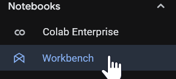
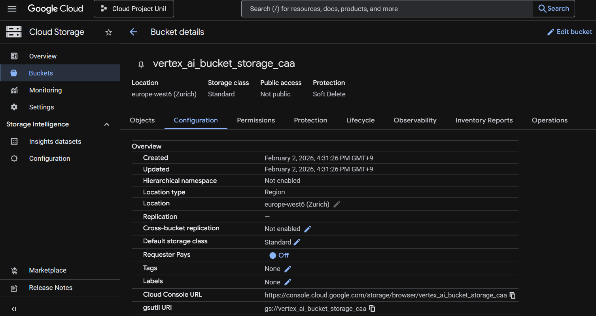

<h1 align="center"> LAB 3 - AutoML</h1>
<div>
<td> 
</td>
<h2 style="white-space: nowrap">Cloud and Advanced Analytics </h2></td>
<hr style="clear:both">
<p style="font-size:0.85em; margin:2px; text-align:justify">
<br>
<br>
</div>

## !! IMPORTANT BEFORE YOU START !!
During this lab, Vertex AI will use approximately €20-25. It takes around 2 hours to run the AutoML model, and an extra half hour to deploy the model. Make sure to disable the deployed model after using it, otherwise you will use a lot of compute credits!

## Learning Goals
In this lab, you'll learn how to build a classification and a regression model from data using Vertex AI.

## Introduction
Welcome to the third lab of Cloud and Advanced Analytics! In this week, we'll introduce you to Vertex AI tool to build Machine Learning models.

## Lab Walkthrough

Vertex AI offers two model training methods, AutoML and custom training. AutoML lets you train with minimal effort and machine learning experience, while custom training gives you complete control over training functionality. In this lab, we will only use AutoML to keep things simple.

Vertex AI examines the source data type and feature values and infers how it will use that feature in model training. It's recommended that you review each column's data type to verify that it's been interpreted correctly. If needed, you can specify a different supported transformation for any feature. Learn more about transformations.

## Table of contents for exercises: 
* [Exercise 1 Notebook Setup and Initialization](#exercise-1-notebook-setup-and-initialization)
* [Exercise 2 Deploy and Train a model and make a prediction](#exercise-2-deploy-and-train-a-model-and-make-a-prediction)
* [Exercise 3 Important disable the deployed model](#exercise-3-important-disable-the-deployed-model)
  
### Pre-Lab Setup 

* Enable vertex AI APIs


-----------------------------------
### **Exercise 1 Notebook Setup and Initialization**
-----------------------------------

In this exercise, we will look on how to **create a Notebook** that we will use for our Machine Learning algorithm later in. 

**Step 1: Creation of Notebook:**

* **1.1** Please go to your [Google Cloud Console](https://console.cloud.google.com) and for this lab, you will need to **Enable all recommended APIs** for each step when prompted.
* **1.2** In the search bar, enter **Vertex AI**, you will arrive at the Vertex AI Dashboard. If you are in the **Studio** section, click on Vertex AI just before the "/".
* **1.3** In the left navigation pane, under **Notebooks**, choose **Workbench**.
* **1.4** You will need to create a new instance - click on **Create new** and change the region to europe-west6 (Switzerland), then click **Create**.
* **1.5** Once the Notebook has been created (**wait for it to be provisioned**, about 1-2 minutes), then select **Open JupyterLab**, and in the Notebook section, select **Python 3 (ipykernel)**.
* **1.6** Install the Vertex AI SDK for Python and its dependent SDKs by adding the following code at the top of your notebook and running it:
* ``` python
  !pip install --upgrade --quiet google-cloud-aiplatform
  !pip install --upgrade google-cloud-storage # if you get an error, specifically choose version "pip install --upgrade google-cloud-storage==2.14.0"
  !pip install protobuf

* **1.7** Once these two packages are installed successfully, restart the kernel. You can restart the kernel by adding and running this code to your notebook. Click **OK** once you get the message pop-up. 

    ```python
    import os

    if not os.getenv("IS_TESTING"):
        import IPython

        app = IPython.Application.instance()
        app.kernel.do_shutdown(True)
    ```
**Done!** You just initialized your Jupyter Notebook in Vertex AI!


**Hints in case you get stuck:**
* **1.3** 
* **1.4** 
* **1.5**  

-------

**Step 2: Adding a training dataset in AutoML:** Here, you are still working in the same Jupyter Notebook. 

* **2.1** As done in the previous lab, please create a bucket in the Google Cloud Storage and add a name, i.e.: vertex_ai_bucket_storage, and select **Region** Zurich, then click on **CREATE**. You can now go into **Configuration** tab of your bucket and copy the **gsutil URI** - we will need it in the next step. You can now download the dataset found [here](https://github.com/michalis0/Cloud-and-Advanced-Analytics/blob/main/labs/03-AutoML/data/train_data.csv) and upload it in your bucket.
* **2.2** Now you can copy the code below and insert your: project ID, the gsutil URI and the REGION "europe-west6".

* ```python
  #set project id, bucket name and region
  PROJECT_ID = 'your_project_id' #from the above code you can get your project id
  BUCKET_NAME = 'gs://BUCKET_NAME' #you can set your own bucket name
  REGION = 'europe-west6' #change the region if different
  ```
* **2.3** You can now add this code, which will fetch the file (the training set) that you just imported. 
    ```python
    IMPORT_FILE = 'train_data.csv'
    gcs_path = f"{BUCKET_NAME}/{IMPORT_FILE}"
    ```

* **2.4** Initialize the AI platform and create the dataset in AutoML by adding these lines to the same notebook.

* ```python
  #import necessary libraries
  import os
  from google.cloud import aiplatform

  #initializing the AI platform
  aiplatform.init(project=PROJECT_ID, location=REGION)

  #creating dataset in AutoML
  ds = aiplatform.TabularDataset.create(
    display_name = 'data_tabular', #set your own name
    gcs_source = gcs_path)

**Hints in case you get stuck:**
* **2.2** 

--------------------------------------------
### **Exercise 2 Deploy and Train a model and make a prediction**
--------------------------------------------

**Step 1: Deploying the model:**

* **1.1** Run these lines in the same notebook. This will create a job to perform the training.
* ```python
  #create a training job in AutoML to run the model
  job = aiplatform.AutoMLTabularTrainingJob(
    display_name = 'training_lab3',
    optimization_prediction_type = 'classification',
    column_transformations = [
         {'text': {'column_name': 'sentence'}}])
  
  #run the model
  #this will take time, depending on your dataset
  model = job.run(
    dataset = ds,
    target_column = 'difficulty',
    model_display_name = 'training_lab3',
    disable_early_stopping = False)
* **Note**: In this lab, we choose to perform the training on a small batch of the dataset to gain some time. **train_data.csv**. However, this is expected to take about 1 hour and 50 minutes.
* **Note**: You can check the status of the training in **Google cloud console**, in the left navigation pane, under the **Model development**, go to **Training**. You should see a new row that has as name: **training_lab3**

* **1.2** Once training status is **Finished**, we will deploy our model using endpoint. Endpoint is a Vertex AI components that allows you to deploy a model and use it later to perform predictions:
  * **1.2.1** Click on **Model Registry** in the left navigation pane, find your model (make sure to filter the correct region), then click on **training_lab3**.
  * **1.2.2** Click on the tab **Deploy & test** at the top of the page.
  * **1.2.3** Click on **Deploy to endpoint**.
  * **1.2.4** Choose an endpoint name and keep the location and the access as it is by default and click on **Continue**
  * **1.2.5** For **Model settings**, change the machine_type to **n1-standard-4**. Also set **Feature attribution** instead of **No explainability** under **Explainability options** and click on **Continue**
  * **1.2.6** Disable model monitoring for this endpoint and click on **Deploy**, this might take a while (~30min).

**Hints in case you get stuck:**
* **1.2.2** 
* **1.2.6**  

**Step 2: Make a prediction:**

You're now ready to use the test data to make a prediction request. The prediction request invokes your model to predict a given sentence's difficulty.

* **2.1** Once your model is deployed, go to **Test your model** at the bottom of the page
* **Note**: Remember that the model predicts from a given French sentence the difficulty of that sentence (A1 or A2 or B1 or B2 or C1 or C2)

* **2.2** In **Value**, give a sentence (in French) to see the predicted outcome and click **Predict**.

* There are some examples: 
* Pour que les actions de terrain contre la diffusion des campagnols terrestres aient une certaine efficacité, il est important qu'elles soient déployées dans des lieux où les possibilités de passage entre deux taches sont en nombre limité ; inversement, si on met en place une action dans un contexte paysager où de nombreuses alternatives de passage existent, il y a plus de chance que le dispositif soit "contourné".
* Une saison parfaite pour les sorcières.
* Le tableau paraissait plus beau qu'avant.
* Tu as eu des nouvelles de Marie.
* Sur les cinq heures, il entendit la canonnade : c'étaient les préliminaires de Waterloo.
* L'homme impoli est le lépreux du monde fashionable.


**Hints in case you get stuck:**
* **2.2** 

--------------------------------------------
### **Final step: Important disable the deployed model**
--------------------------------------------

It is important that you remove your instance from running, or else you will be charged continuously even if you are not using it anymore. 

To do so, you can go to **Model Registry**, find your deployed model, and undeploy it! 

Please **do not forget this step**, or else you will be charged and you will not have enough credits for the end of the class! 
