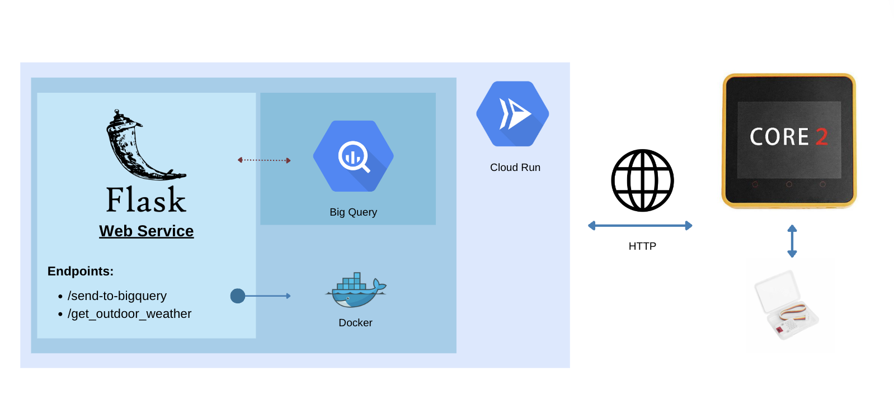

<table border="0" width="100%">
  <tr>
    <td width="250" valign="top">
      
    </td>
    <td valign="middle">
      <h2>Cloud and Advanced Analytics</h2>
    </td>
  </tr>
</table>

<h1 align="center">IoT: Sending Data to BigQuery</h1>

# TODO for 2027
Use the "self._client.insert_rows_json(...)" to insert data fast from M5stack to middleware to Bigquery.

## Learning Goals
By the end of this lab you will learn:

* How to setup an M5stack core2 device and connect it to Internet.
* How to program an M5stack device using the [uiFlow platform](https://flow.m5stack.com/)
* How to insert new data into a bigQuery database.
* How to get current weather data for a specific location using the [openweather api](https://home.openweathermap.org/).
* Creating a web-app with different endpoints using Flask and deploying it using GCloud cloud run.

## Table of contents for exercises: 

[This notebook](https://github.com/michalis0/Cloud-and-Advanced-Analytics/blob/main/labs/04-IoT/WalkThrough.ipynb) will guide you through the following content.

1. **Introduction and IOT devices:**

2. **Setting up the weather sensor for measuring the indoor temperature and humidity**

3. **Creating a BigQuery database with the proper schema**
- 3.1 Defining the BigQuery database
- 3.2 Test the BigQuery database we just created 
- 3.3 Insert new rows in the BigQuery table

4. **Creating a new web service that receives data form the IoT device**
5. **Deploying the Flask app in Google Cloud** 
6. **Updating the m5stack.py with the URL of the deployed web service**
7. **Your turn**

## General View of the Lab:

  
