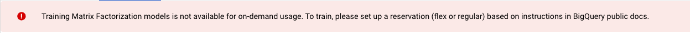

<h1 align="center"> Lab 5: Building Recommender systems with BigQuery ML </h1>
<div>
<td> 
</td>
<h2 style="white-space: nowrap">Cloud and Advanced Analytics </h2></td>
<hr style="clear:both">
<p style="font-size:0.85em; margin:2px; text-align:justify">
<br>
<br>
</div>


In this lab, we will learn to use the BigQuery ML tool in order to build a recommendation system. Furthermore, we will learn how to use the trained model in order to 
get recommendations for a user and how to deploy the model in a web service.

## Learning Goals:
By the end of this lab, you will:
- Learn how to train, evaluate, and test a recommender system using SQL queries (BigQuery ML)
- Learn how to create reservation slots for BigQuery. This is required for BigQuery ML.

## Introduction
BigQuery ML enables users to create and execute machine learning models in BigQuery using SQL queries. The goal is to democratize machine learning by enabling SQL practitioners to build models using their existing tools and to increase development speed by eliminating the need for data movement.

In this walkthrough, you will learn how to build a matrix factorization model from [implicit feedback recommendation](https://baotramduong.medium.com/recommender-system-impicit-vs-explicit-feedback-394917307a7f#:~:text=Definition%3A,%2C%20actions%2C%20or%20implicit%20signals.) data using MovieLens small recommendation dataset. Then you will see how to generate recommendations for a specific user ID using the trained BigQuery ML model. The dataset for this assignment can be found [here](data/).

### MovieLens small recommendation dataset
This dataset contains ratings by the users on the [MovieLens](http://movielens.org/) platform, a movie recommendation service. To convert the recommendation problem to implicit feedback, we have scaled the ratings to be between 0 and 1, i.e., the probability of a user interacting with a movie. The dataset contains __100836 ratings__ across __9742 movies__. These data were created by __610 users__ between March 29, 1996 and September 24, 2018. The structure of the [ratings table](data/ml-small-ratings.csv) looks like the following:


## Table of Contents
1. [Building a recommendation model using BigQuery ML](#1--building-a-recommendation-model-using-bigquery-ml)
2. [Test the trained BigQuery ML model in Python](#2--test-the-trained-bigquery-ml-model-in-python)

----------
## 1- Building a recommendation model using BigQuery ML
In this section we will create a new BigQuery dataset and upload the [ratings](data/ml-small-ratings.csv) and the [links](data/ml-small-links.csv) table in it. Then we will build our first recommendation model using a SQL query.

- 1.1 Login to your Google Cloud Console. Following the last week's lab instructions, create a new dataset in BigQuery and upload the ratings and links tables. Note that since the size of these two datasets is small, you can upload the csv files directly in BigQuery.
- 1.2 In the BigQuery studio, run some sample queries on the ratings and links tables and check their content. For example:
```
SELECT * from `test-caa-labs.lab5_dataset.ml-small-ratings` limit 10
```
- 1.3 Next, you create an implicit recommendations model using the ratings table that was loaded in the step 1.1. The following GoogleSQL query is used to create the model that will be used to predict a confidence rating for every `userId`, `movieId` pair.
```
CREATE OR REPLACE MODEL `test-caa-labs.lab5_dataset.first-MF-model`
OPTIONS
  (model_type='matrix_factorization',
   feedback_type='IMPLICIT',
   user_col='userId',
   item_col='movieId',
   rating_col='rating_im') AS
SELECT
  userId,
  movieId,
  rating_im
FROM `test-caa-labs.lab5_dataset.ml-small-ratings`
```
#### Query details
The `CREATE MODEL` clause is used to create and train the model. In the above query, we have named this model  as `first-MF-model`.

The `OPTIONS(model_type='matrix_factorization', feedback_type='IMPLICIT', user_col='userId', ...)` clause indicates that you are creating a matrix factorization model. Because `feedback_type='IMPLICIT'` is specified an implicit matrix factorization model will be trained.

This query's `SELECT` statement uses the following columns to generate recommendations.

    - userId
    - movieId
    - rating_im - The implicit rating from 0 to 1 for each userId, movieid pair.

- 1.4 When trying to run the above query, you will notice that the query does not execute and throws the following error:
  
  The reason for the following error is that for running a create model query we need to create a reservation slot. The BigQuery Reservation API lets you purchase dedicated slots, and assign projects, folders, and organizations to those reservations. In what follows we will create a reservation slot for our project. You can also do that by following the [GCloud documentation](https://cloud.google.com/bigquery/docs/reservations-assignments).

    - 1.4.1 In BigQuery, from the left menu select capacity management.

      
    
    - 1.4.2 From the top bar select __CREATE RESERVATION__. Select a name for your reservation and pick an appropriate location for it, preferebly in the EU.b Leave the other settings as defaul, similar to the image below.

      
    
    - 1.4.3 Once the reservation is created, you will see a table in the SLOT RESERVATIONS tab. For the reservation you just created, click on the three dots and select create assignment.

      
    
    - 1.4.4 Select your project in the assignment settings. In the __Job Type__ section we need to select the `Query` option for this reservation.

      

    - 1.4.5 Once you create a reservation assignment, wait at least 5 minutes before running a query.

- 1.5 Now you can go back to the BigQuery studio and try running the `CREATE MODEL` query. Since this dataset is relativly small, the training of the model will take approximately 2 to 3 minutes.
- 1.6 When the training is finished, from the left menu you can find the trained model. By selecting the trained model you can see the training and evaluation details on the right.

    

- 1.7 You can also evaluate your model using a SQL query.
    ```
    SELECT * FROM 
    ML.EVALUATE(MODEL `test-caa-labs.lab5_dataset.first-MF-model`)
    ```
    As we performed an implicit matrix factorization model, the results includ the following metrics:
    ```
    mean_average_precision
    mean_squared_error
    normalized_discounted_cumulative_gain
    average_rank
    ```
    You can find the explanation of these metrics [here](https://cloud.google.com/bigquery/docs/reference/standard-sql/bigqueryml-syntax-evaluate#matrix_factorization_models).

- 1.8 Fianlly you can make recommendations for a set of users using the `ML.RECOMMEND` clause. ML.RECOMMEND does not need to take any additional arguments besides the model, but can take in an optional table. If the input table only has one column that matches the user Ids, then all of the predicted item ratings for each user will be outputted. Note that if all of the users are in the input table, it will output the same results as passing no optional argument to `ML.RECOMMEND`.The following is an example of a query to fetch all of the predicted rating confidences for 5 users.
    ```
    SELECT * FROM
    ML.RECOMMEND(MODEL `test-caa-labs.lab5_dataset.first-MF-model`,
    (
    SELECT
      userid
    FROM
      `test-caa-labs.lab5_dataset.ml-small-ratings`
    LIMIT 5))
    ```
    Each row of the table resulting from the above query shows the predicted rating confidence for a pair of userId and movieId.

__Exercise:__ Can you craft a SQL query that takes the result of the above query and outputs a table with only the top 5 recommendations for each userId, i.e., the 5 top movies with the highest predicted rating confidence?

## 2- Test the trained BigQuery ML model in Python
Follow the [eval_rec_sys](eval_rec_sys.ipynb) notebook to be able to call the trained BigQuery ML model in python in order to evaluate the model or generate recommendations for a group of users.