<h1 align="center"> LAB 6 - Elastic Cloud</h1>
<div>
<td> 
</td>
<h2 style="white-space: nowrap">Cloud and Advanced Analytics </h2></td>
<hr style="clear:both">
<p style="font-size:0.85em; margin:2px; text-align:justify">
<br>
<br>
</div>

This week, you will learn about Elastic Cloud, a platform which enables search and analytics for both structured and unstructured data.


## Learning Goals
* Become aware of the various components of the Elastic stack and their respective roles
* Explore the Kibana dashboard, the web interface that allows you to explore your data
* Get acquainted with the Query DSL search syntax in Elasticsearch
* Leverage Elasticsearch's "Edge n-gram" tokenizer to create an autocompletion functionality.

## Introduction
Elastic Cloud is a potent suite of services built around Elasticsearch, a distributed, open-source search and analytics engine. Elasticsearch is known for its speed, scalability, and ability to index many types of content, which makes it a go-to choice for applications that require complex search features.

The Elastic Stack (also known as ELK Stack) consists of Elasticsearch for search, Logstash for centralized logging and Kibana for visualization. The Elastic Stack has a wide range of applications, including but not limited to, real-time application monitoring, analyzing business metrics, and web search.

In this lab, we will not only cover the basics of setting up Elastic Cloud but also delve into more advanced topics like data visualization, query DSL, and the creation of autocomplete functionalities

## Lab Walkthrough
1. Step 1 Elastic Cloud setup 
2. Step 2 Exploring Elastic cloud and Kibana & Adding your own data 
4. Step 3 Query Elasticsearch Engine
5. Step 4 AutoComplete with Elasticsearch


---------------
**Step 1 Elasticsearch setup**
- **1.1:** Go to [elastic](https://www.elastic.co/elasticsearch) and **start free trial** (2 week account - no credit card required). Log in with Google using the same Google account you use for Google Cloud and answer the questions. Choose as **use case** the leftmost option **Elasticsearch** (not elastic for observability or for security). After the two weeks, you can add one more free trial week.
- **1.2:** Create a deployment to use the service. Save your **username** and **password** as we will be using it later on.

- 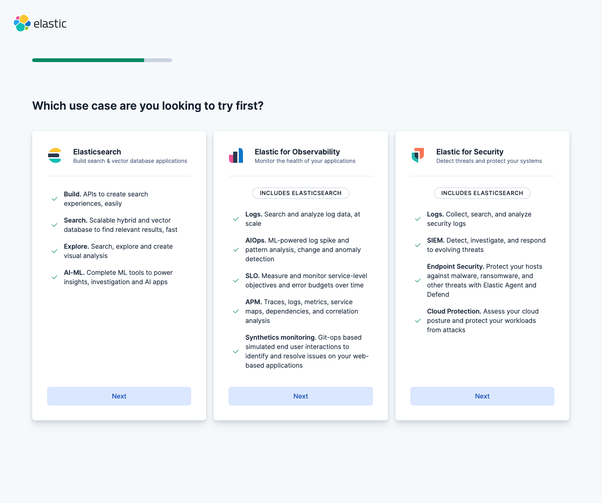
- 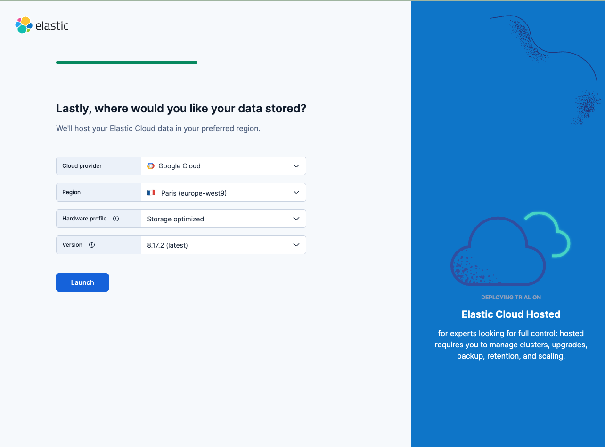

---------------
**Step 2: Exploring Elastic Cloud and Kibana & Adding your own data**

- **2.1:** You can navigate to *Machine Learning* in the left panel and click on **Upload data files**.
- 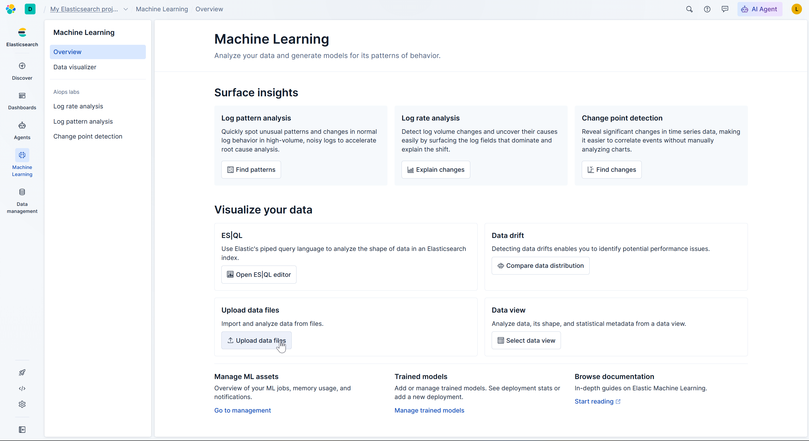
- **2.2:**  You can import the file present in the GitHub, named: **elastic_data_youtube_videos.csv** and drag and drop it inside.
- **NOTICE:** please make sure to be connected to your account, if you are connected as **Guest User** your import button will not be activated (you can check this on the top right corner)
- **NOTICE:** If you have any trouble with the csv file, an NDJSON is available.
- **2.3:** Add the index name: **trending_videos_youtube_elastic_data**, and click **import**, then this will create an index for your data. 
- 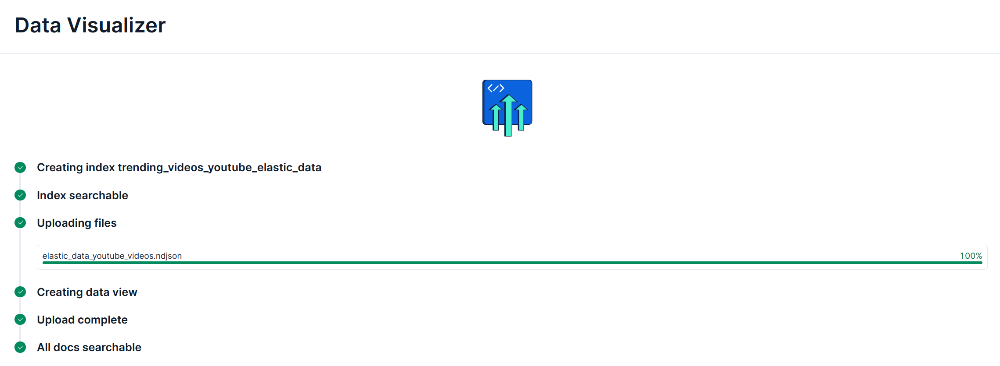
- **2.4:** Once completed, go to **Dashboard** and click on **Create dashboard**. In this new interface, click on **Create visualization**
- 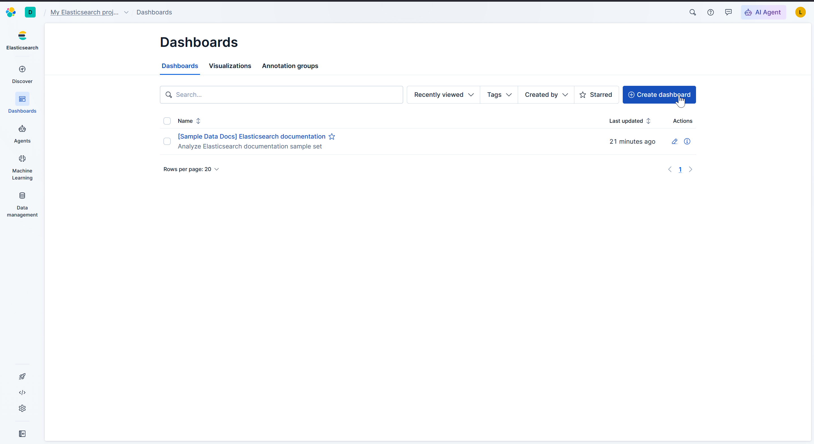
- 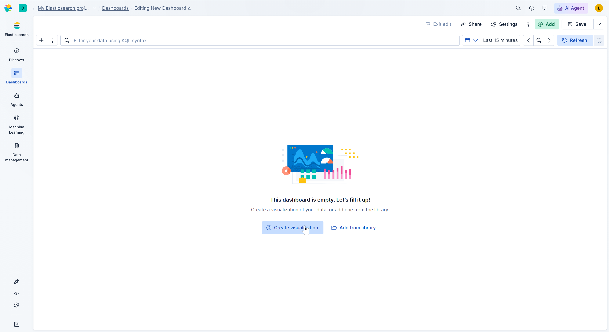
- 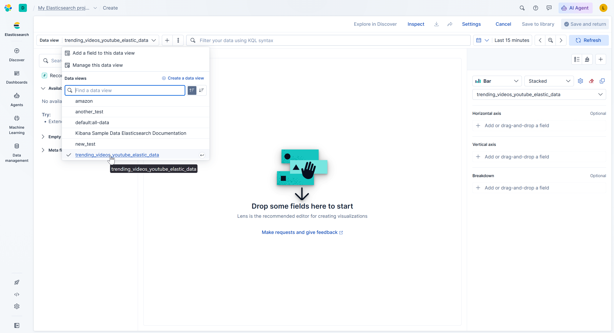
- **2.5:** Create a nice Dashboard for the data, as a starting point, select your data view **trending_videos_youtube_elastic_data** and select in the calendar a period larger than 20 years, then you can select **Bar** and select the Like and the Category ID fields and click on save to add it to your Dashboard. 
- 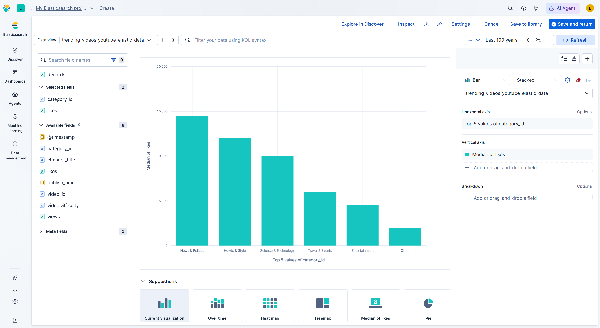
- **2.6**: Add a few graphs to create your Dashboard and copy the graph from the previous image. Spend 10-15 minutes designing a Dashboard, and we will select the best one to present in the board. 


------------------
**Step 3: Query Elasticsearch Engine:**

- **3.1:** You can take a look at the readme.md file found [here](./ElasticSearch/elastic_search.md) to execute queries to Elasticsearch
- **3.2:** To do so, go to the left menu and select **Developer Tools**
- 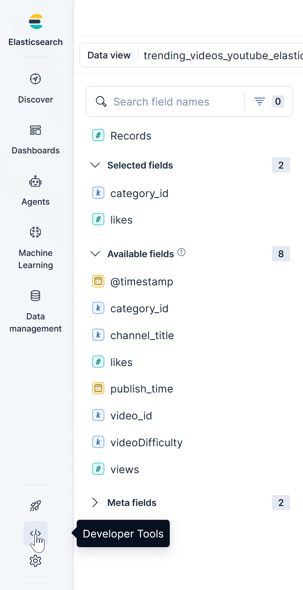

- **3.3:** Now, you can query the database we created earlier:
  ```
  GET trending_videos_youtube_elastic_data/_search
  ```
- **3.4:** Example queries:
  - **Example query 1:** This query gets the videos from the category id Education and applies a filter for videos with more than 100'000 likes: 
  - ```bash
    GET trending_videos_youtube_elastic_data/_search
    {
      "query": {
        "bool": {
          "must": [
            {"match": {"category_id": "Education"}}
          ],
          "filter": [
            {"range": {"likes": {"gte": 100000}}}  // Greater or equal to
          ]
        }
      }
    }
    ```
  - **Example query 2 (To be done later in Colab):** This simple query gets the text input and searches the database (it returns the results with the title and videoDifficulty):
  - ```bash
    response = client.search(index="trending_videos_youtube_elastic_data", q="Pourquoi")
    # Process search results
    for hit in response['hits']['hits']:
        print(hit['_source']['title'], hit['_source']['videoDifficulty'])
    ```
------------------
**Step 4: AutoComplete with Elasticsearch:**

- In this section, we will perform autocomplete, by querying the dataset we created before. 
- **4.1** To do so, you will first need to generate an API key to have access to the database from a Python file. You can navigate to **Overview** and click on **New** (see screenshot) 

- 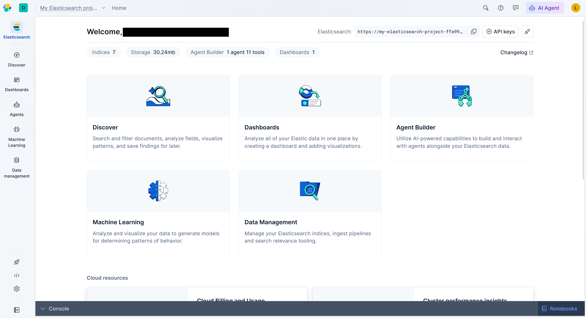
- 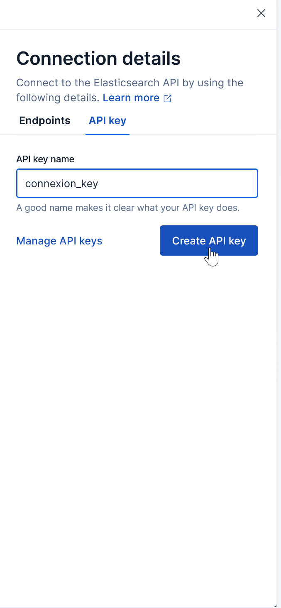

- **4.2** You can name the key, i.e: connexion_key and click create API key, then copy the API key from the **Endpoints** panel.
- **4.3** Open the [code](./Autocomplete/Autocomplete.ipynb) in Google Colab and add your credentials:
    - **URL_ENDPOINT** can be found by clicking on elasticSearch > python
    - **API_KEY** corresponds to the **encoded** key generated before
    - **INDEX_NAME** corresponds to your index name, which can be found under **Search** - **Elasticsearch** - **indices**

- **4.4** Run the code and be sure that when you run client, you get an answer (to ensure the connexion is working correctly) and test out the code !
