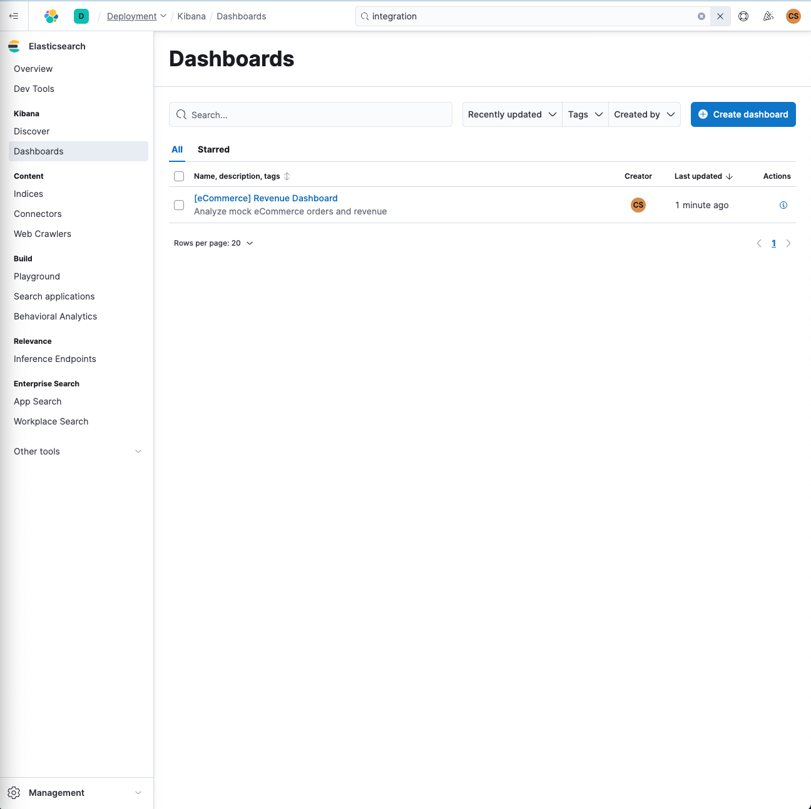

<h1 align="center"> LAB 6 - Elastic Cloud</h1>
<div>
<td> 
</td>
<h2 style="white-space: nowrap">Cloud and Advanced Analytics </h2></td>
<hr style="clear:both">
<p style="font-size:0.85em; margin:2px; text-align:justify">
<br>
<br>
</div>

This week, you will learn about Elastic Cloud, a platform which enables search and analytics for both structured and unstructured data.


## Learning Goals
* Become aware of the various components of the Elastic stack and their respective roles
* Explore the Kibana dashboard, the web interface that allows you to explore your data
* Get acquainted with the Query DSL search syntax in Elastic Search
* Leverage Elasticsearch's "Edge n-gram" tokenizer to create an autocompletion functionality.

## Introduction
Elastic Cloud is a potent suite of services built around Elasticsearch, a distributed, open-source search and analytics engine. Elasticsearch is known for its speed, scalability, and ability to index many types of content, which makes it a go-to choice for applications that require complex search features.

The Elastic Stack (also known as ELK Stack) consists of Elasticsearch for search, Logstash for centralized logging and Kibana for visualization. The Elastic Stack has a wide range of applications, including but not limited to, real-time application monitoring, analyzing business metrics, and web search.

In this lab, we will not only cover the basics of setting up Elastic Cloud but also delve into more advanced topics like data visualization, query DSL, and the creation of autocomplete functionalities

## Lab Walkthrough
1. Step 1 Elastic Cloud setup 
2. Step 2 Exploring Elastic cloud and Kibana
3. Step 3 Adding your own data 
4. Step 4 Query Elastic Search Engine
5. Step 5 AutoComplete with Elastic Search


---------------
**Step 1 Elastic Search setup**
- **1.1:** Go to [elastic](https://www.elastic.co/elasticsearch) and **start free trial** (2 week account - no credit card required). Login with Google using the same Google account you use for Google Cloud and answer the questions. Choose as **use case** the most left option **Elasticsearch** (not elastic for observability or for security). After the two 2 weeks, you can add one more free trial week.
- **1.2:** Create a deployment to use the service. Save your **username** and **password** as we will be using it later on.

- 
- 

---------------
**Step 2: Exploring Elastic Cloud and Kibana**
- **2.1:** Once you have created your deployment, click on it to access it!
- **2.2:** You should be now on the **Overview** page under Elasticsearch. Click on **Sample data**. Open **Other sample data sets** and choose the "Sample eCommerce orders" dataset by clicking on **Add data**.
-  then on **Start Exploring**. Finally, under **Data visualization** please click on **Dashboards**.

- 
- 

- **2.3:** If you go now to Dashboards under Kibana, you will see that a dataset is added called **[eCommerce] Revenue Dashboard**. Click on it. This will open a Dashboard connected to a database with ecommerce information such as sales, revenue, items and much more! Have a look and play around with the Dashboard. Navigate to the plot called **breakdown by category**, select **womens's clothing**, click on the three small dots on the side and click on **Filter for** to filter.

- 

- **2.4:** You can now navigate back to the menu and select **Canvas** under **Other tools** and select **[eCommerce] Revenue Tracking**
  
- 

- **2.6:** You can also have a look at the menu and select **Graphs**  and select **Kibana Sample Data - eCommerce** 

----------------
**Step 3 Adding your own data**


- **3.1:** You can navigate to the home page (Overview) and click on **Upload a file**.
- 
- **3.2:**  You can import the file present in the Github, named: **elastic_data_youtube_videos.csv** and drag and drop it inside.
- **NOTICE:** please make sure to be connected to your account, if you are connected as **Guest User** your import button will not be activated (you can check this on the top right corner)
- **3.3:** Click **import** and add the index name: **trending_videos_youtube_elastic_data**, which will create an index for your data. Once completed, click on **View index in Discover** 
- 
- **3.4:** You can go back to the menu and in **Analytics** click on **Dashboard** and click on **Create a dashboard** and **Create a visualization**
- **3.5:** Create a nice Dashboard for the data, as a starting point, you can select **Bar** and select Like and Category ID and click on save to add it to your Dashboard. 
- 
- **3.6**: Add a few graphs to create your Dashboard. Spend 10-15 minutes designing a Dashboard and we will select the best to present in the board. 


------------------
**Step 4: Query Elastic Search Engine:**

- **4.1:** You can take a look at the readme.md file found [here](./ElasticSearch/elastic_search.md) to execute queries to Elastic Search
- **4.2:** To do so, go to the left menu and select Dev tools
- 
- **4.3:** In the console, copy and paste the following query. Click on the green button to execute the query.
  ```
  GET kibana_sample_data_ecommerce/_search
  ```
- 
- **NOTE** If you are not able to query, you can try to open [this](https://demo.elastic.co/app/dev_tools#/console) in a new tab and execute the queries from here
- **4.4:** Follow the tutorial. 
- **4.5:** You can also query the database we created before:
  ```
  GET trending_videos_youtube_elastic_data/_search
  ```
- **4.6:** Example queries:
  - **Example query 1:** This query gets the videos from the category id Education and applies a filter for videos with more than 100'000 likes: 
  - ```bash
    GET trending_videos_youtube_elastic_data/_search
    {
      "query": {
        "bool": {
          "must": [
            {"match": {"category_id": "Education"}}
          ],
          "filter": [
            {"range": {"likes": {"gte": 100000}}}  // Greater or equal to
          ]
        }
      }
    }
    ```
  - **Example query 2 (To be done later in Colab):** This simple query gets the text input and searches the database (it returns the results with the title and videoDifficulty):
  - ```bash
    response = client.search(index="trending_videos_youtube_elastic_data", q="Pourquoi")
    # Process search results
    for hit in response['hits']['hits']:
        print(hit['_source']['title'], hit['_source']['videoDifficulty'])
    ```
------------------
**Step 5: AutoComplete with Elastic Search:**

- In this section, we will perform autocomplete, by querying the dataset we created before. 
- **5.1** To do so, you will first need to generate an API key to have access to the database from a Python file. You can navigate to **Overview** and click on **New** (see screenshot) 

- 
- 

- **5.2** You can name the key, i.e: connexion_key and click create API key, then copy the API key (all of it)
- ```bash
    {
    "id": "",
    "name": "connexion_key",
    "expiration": ,
    "api_key": "",
    "encoded": "",
    "beats_logstash_format": ""
    }
    ```

- **5.3** Open the [code](./Autocomplete/Autocomplete.ipynb) in Google Colab and add your credentials:
    - **URL_ENDPOINT** can be found by clicking on elasticSearch > python
    - **API_KEY** corresponds to the **encoded** key generated before
    - **INDEX_NAME** corresponds to your index name, which can be found under **Search** - **Elasticsearch** - **indices**

- **5.4** Run the code and be sure that when you run client, you get an answer (to ensure the connexion is working correctly) and test out the code !
