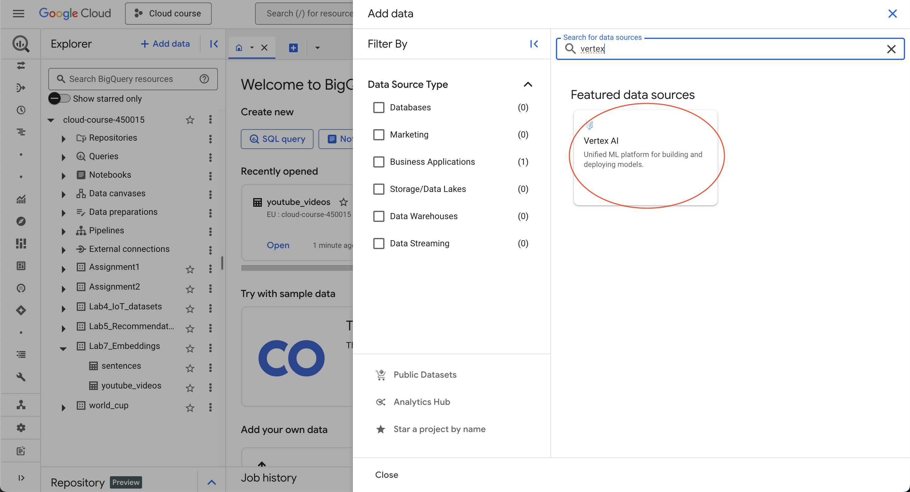
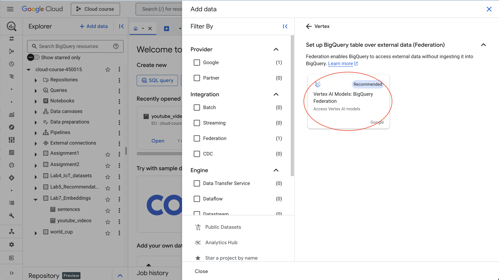
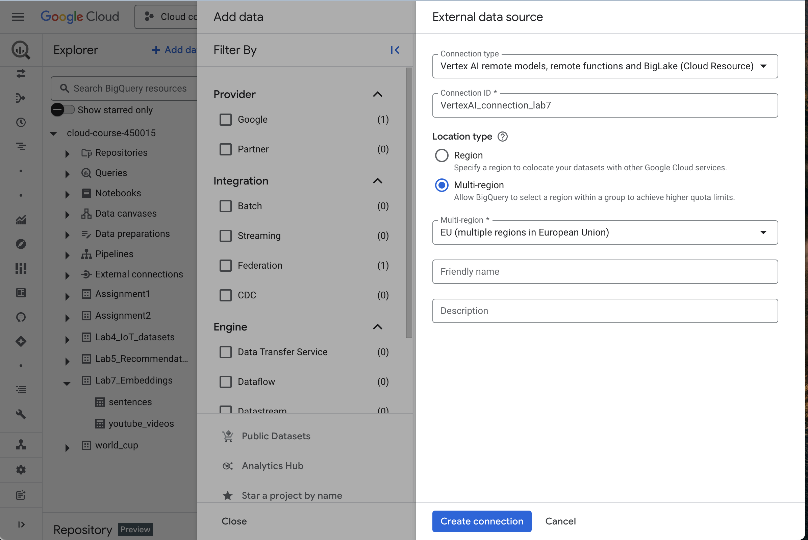
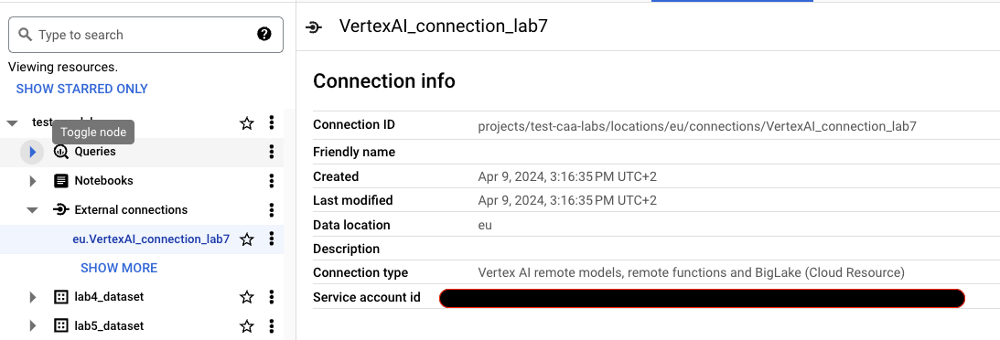

<h1 align="center"> Semantic search using BigQuery embeddings</h1>
<div>
<td> 
</td>
<h2 style="white-space: nowrap">Cloud and Advanced Analytics </h2></td>
<hr style="clear:both">
<p style="font-size:0.85em; margin:2px; text-align:justify">
<br>
<br>
</div>

This week you will continue to learn about elastic search. More precisely, we will have a look at search using embeddings - [resource on vector embeddings](https://www.elastic.co/what-is/vector-embedding) . 


## Introduction

Embeddings are representations of words or phrases in a multi-dimensional space where similar items are closer together. In text search, embeddings encode the semantic meaning of words, allowing for more accurate retrieval of relevant documents compared to simple term-based search. This is because embeddings capture contextual and semantic relationships between words, enabling search engines to understand nuances in language and deliver more precise results. 

In this lab, you'll utilize embeddings and Elasticsearch to explore how they enhance search efficiency. During this lab, we will use the following two datasets:
- **The first dataset** has been used in the previous lab, it has multiple trending youtube videos and can be found [here](./data/elastic_data_youtube_videos.csv)
- **The second dataset** contains different sentences from various categories, allowing you to test out those embeddings and have a more practical understanding on how it works. It can be found [here](./data/sentences.csv)

## Lab Walkthrough
**Step 1:** Embedding Search using Big Query

---------------
**Step 1: Embedding Search using Big Query**
In this part we walk through the end-to-end process of creating and using text embeddings, including user vector indexes within BigQuery to improve search performance.

__From the [documentation](https://cloud.google.com/bigquery/docs/vector-index)__: A vector index is a data structure designed to let the VECTOR_SEARCH function perform a more efficient vector search of embeddings. When VECTOR_SEARCH is able to use a vector index, the function uses the Approximate Nearest Neighbor search technique to help improve search performance, with the trade-off of reducing recall and thus returning more approximate results.

- **1.1:** Create a Bigquery dataset. For the **"Location type"** parameter select **"Multi-region"** and from the drop-down menu select **"EU (Multiple regions in EU)**. Create separate tables for the two datasets:
  - **sentences** --> sentences.csv
  - **youtube_videos** --> elastic_data_youtube_videos.csv
 
- **1.2:** Next, we will create a BigQuery ML remote model over a VertexAI Large Language Model (LLM). We will use this model to generate embedding vectors for the text data.

  - **1.2.1** First, you need to create a Cloud resource connection and get the connection service account. Create the connection in the same location as the dataset you created, i.e., in EU.

    - In the BigQuery page click on **Add data** and search for **Vertex AI**.
    
    - In the Connection ID field, enter a name for your connection, e.g. VertexAI_connection_lab7. In the Connection type list, select **Vertex AI remote models, remote functions and BigLake (Cloud Resource)**.
      
      

    - Click Create Connection. Then go to the connection and in the drop-down **External connections** info panel, copy the **service account ID** - last ID in the UI. You will need it later.

  - **1.2.2** Next you need to grant the connection's service account an appropriate role to access the Vertex AI service.
  
    - Go to **IAM & Admin page**.
    - Click Grant Access.
    - In the New principals field, enter the **service account ID** that you just copied.
    - In the Select a role field, choose Vertex AI, and then select **Vertex AI User** role and then click save.
    
    

  - **1.2.3** Now you will create the remote model for text embedding generation. This remote model represents a hosted Vertex AI text embedding generation model. In the BigQuery query editor run the following statement:
  ```
  CREATE OR REPLACE MODEL `DATASET_NAME.embedding_model`
  REMOTE WITH CONNECTION `eu.CONNECTION_ID`
  OPTIONS (ENDPOINT = 'text-embedding-005');
  ```
  **Note** in this case, the connection id is eu.VertexAI_connection_lab7
  
  The query takes several seconds to complete, after which the model **embedding_model appears under your dataset in the Explorer pane**. Because the query uses a CREATE MODEL statement to create a model, there are no query results.

- **1.3:** Now that we have create the embedding model, we can generate embeddings for our datasets. To do so, we use the `ML.GENERATE_EMBEDDING` function, and then write the embeddings to a BigQuery table so that they can be searched. In the query editor, run the following statement:

```
CREATE OR REPLACE TABLE `DATASET_NAME.embeddings` AS
SELECT * FROM ML.GENERATE_EMBEDDING(
  MODEL `DATASET_NAME.embedding_model`,
  (
    SELECT *, Sentences AS content
    FROM `DATASET_NAME.sentences`
    WHERE LENGTH(Sentences) > 0 
  )
)
WHERE LENGTH(ml_generate_embedding_status) = 0;
```
This query generates a new table called `embeddings` that contains the embedding vectors for each document in the sentences table. You can run the following statement to observe the dimensionality of the generated embeddings:
```
select ARRAY_LENGTH(ml_generate_embedding_result), content from `DATSET_NAME.embeddings`
limit 10
```
- **1.4:** 
Finally we can perform a text similarity search using the created embeddings. We use the `VECTOR_SEARCH` function to search for the top 5 relevant sentences that match embeddings generated from a text query. The model we use to generate the embeddings in this query must be the same as the one we use to generate the embeddings in the table we are comparing against, otherwise the search results won't be accurate. 

Run the following query in the query editor. Try to use different search terms such as _sport news_, _modern technology_, etc. Do the results make sense to you?
```
SELECT query.query, base.Sentences
FROM VECTOR_SEARCH(
  TABLE `DATASET_NAME.embeddings`, 'ml_generate_embedding_result',
  (
  SELECT ml_generate_embedding_result, content AS query
  FROM ML.GENERATE_EMBEDDING(
  MODEL `DATASET_NAME.embedding_model`,
  (SELECT 'sport news' AS content))
  ),
  top_k => 5, options => '{"fraction_lists_to_search": 0.01}')
```

__Remark__: Note that for large datasets with more than 5000 rows, you can not directly apply the `VECTOR_SEARCH` on the generated table with the embeddings and you need to create a vector index. For more information on this, check out the [documentation](https://cloud.google.com/bigquery/docs/vector-index-text-search-tutorial#create_a_vector_index)
----------------


**Note: Here is the code to do the same but with the youtube videos dataset**

```bash
CREATE OR REPLACE TABLE `vector_dataset.embeddings` AS
SELECT * FROM ML.GENERATE_EMBEDDING(
  MODEL `vector_dataset.embedding_model`,
  (
    SELECT *, title AS content
    FROM `vector_dataset.Youtube_videos`
    WHERE LENGTH(title) > 0 
  )
)
WHERE LENGTH(ml_generate_embedding_status) = 0;


select ARRAY_LENGTH(ml_generate_embedding_result), content from `DATSET_NAME.embeddings`
limit 10


SELECT query.query, base.title
FROM VECTOR_SEARCH(
  TABLE `vector_dataset.embeddings`, 'ml_generate_embedding_result',
  (
  SELECT ml_generate_embedding_result, content AS query
  FROM ML.GENERATE_EMBEDDING(
  MODEL `vector_dataset.embedding_model`,
  (SELECT 'sport news' AS content))
  ),
  top_k => 5, options => '{"fraction_lists_to_search": 0.01}')

SELECT query.query, base.title
FROM VECTOR_SEARCH(
  TABLE `vector_dataset.embeddings`, 'ml_generate_embedding_result',
  (
  SELECT ml_generate_embedding_result, content AS query
  FROM ML.GENERATE_EMBEDDING(
  MODEL `vector_dataset.embedding_model`,
  (SELECT 'le sport' AS content))
  ),
  top_k => 5, options => '{"fraction_lists_to_search": 0.01}')

```


