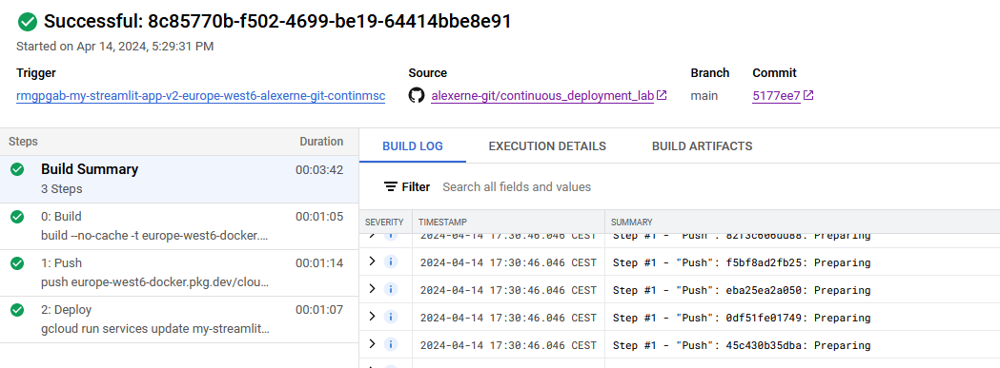
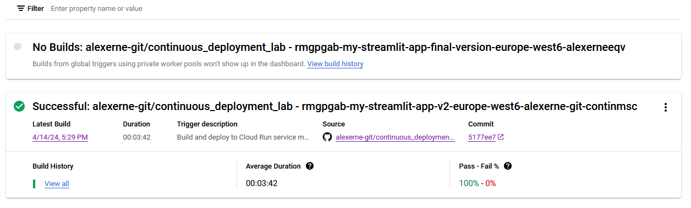
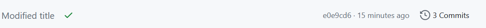

<h1 align="center"> Continuous integration</h1>
<div>
<td> 
</td>
<h2 style="white-space: nowrap">Cloud and Advanced Analytics </h2></td>
<hr style="clear:both">
<p style="font-size:0.85em; margin:2px; text-align:justify">
<br>
<br>
</div>


# Continuous Integration using Google Cloud Build

## Introduction

This guide will walk you through setting up continuous integration (CI) for a Streamlit web application using Google Cloud Build. With CI, you can automate the testing and deployment process whenever changes are made to your codebase.

### Prerequisites

Before getting started, make sure you have the following:

- Enable the APIs [documentation](https://cloud.google.com/run/docs/continuous-deployment-with-cloud-build#existing-service) or you can just click on this [link](https://console.cloud.google.com/flows/enableapi?apiid=sourcerepo.googleapis.com,cloudbuild.googleapis.com)
- Enable the Identity and Access Management (IAM) API for your GCP project [here](https://console.cloud.google.com/apis/library/iam.googleapis.com).


## Getting Started

1. **Create a new GitHub Repository**:
   - Create a new repository named "continuous_deployment_lab" on GitHub.
   - Clone this repository to your local machine (or create it directly using github desktop)

2. **Add Files to Repository**:
   - Copy the following files from this repository:
     - Dockerfile
     - app.py
     - requirements.txt
   - Add these files to your newly created GitHub repository.

3. **Test the Code**:
   - Run the Streamlit app locally to ensure everything is working:
     ```
     streamlit run app.py
     ```
   - Once verified, commit the code changes to your GitHub repository.

## Deploy to Google Cloud

1. **Deploy to Google Cloud Run**:
   - Deploy your Streamlit app to Google Cloud Run as we have done in the past. But first start by pushing your code to Github !

2. **Push to Artifact Registry**:
   - Build the Docker image:
     ```
     docker build -t eu.gcr.io/PROJECT_ID/my_streamlit_app_v1:latest .
     ```
   - Push the Docker image to Google Cloud Artifact Registry:
     ```
     docker push eu.gcr.io/PROJECT_ID/my_streamlit_app_v1:latest
     ```

3. **Verify Deployment**:
   - Check the Artifact Registry to ensure the image has been pushed successfully.
   - Deploy the image to Cloud Run, allowing unauthenticated invocations.
   - 
   - 
  - Check that everything runs correctly !

## Setting Up Continuous Integration

1. **Connect GitHub with Cloud Build**:
   - Navigate back to the artifact Registery and as before select the image and **Deploy to Cloud Run**
   - Click on "Continuously deploy from a repository" and follow the prompts to connect your GitHub account (Select: SET UP WITH CLOUD BUILD)
   - 
   - Select the corresponding github repository and for the build configuration select **Dockerfile**
    - 
    - 
   - Then click **Save**

2. **Building process**:
   - This will launch the building process, you can click on **logs** to see where it stands
   - 
   - Once built (approx. 3-4 minutes), you can view the details
   - 
   - Then you can search for cloud build in the search bar and select **Dashboard** which will show you all the builds status
   - 
   - Alternatively, you can go to your repository and look if the build has passed 
   - 
   - Finally you can go to cloud run to see your URL where the app is deployed

3. **Further changes**:
   - Now that your project is set up for continuous deployment you can go ahead and change the title of your streamlit app, for example
   - ```bash
      st.write("This is the modified title")
      ```
   - Then you can commit and wait for the new version to build and be pushed on google Cloud run ! 
   - This will appear as **Checked** on your github 
   - 
