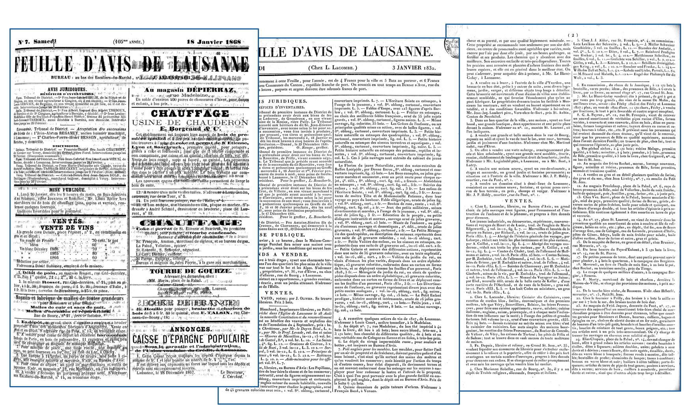
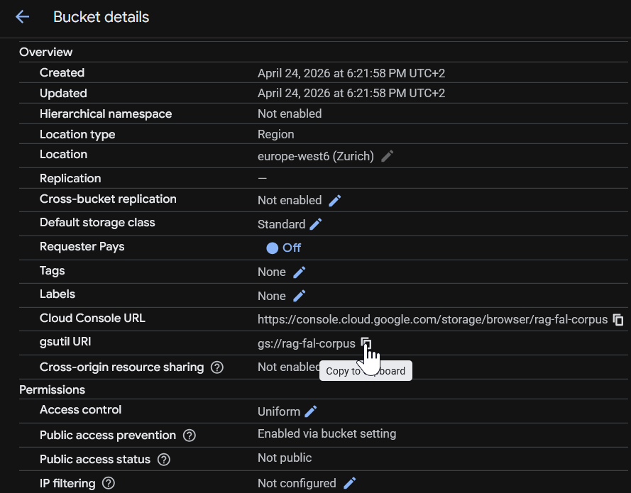
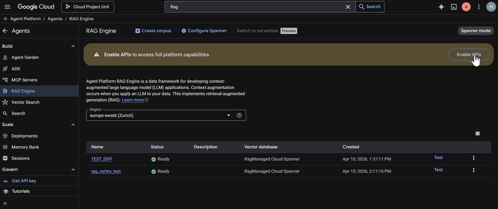
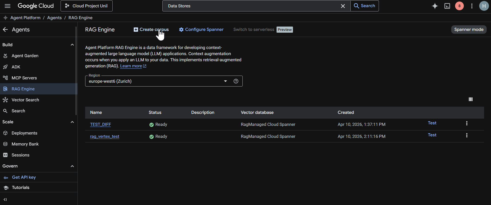
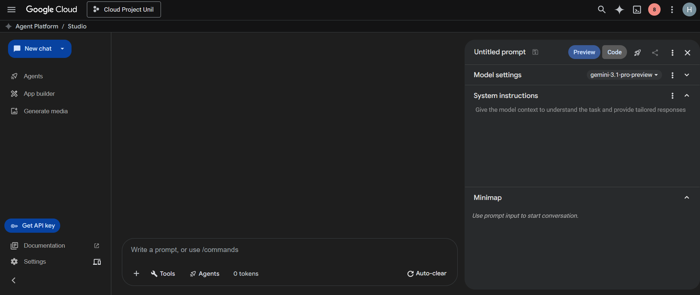

<h1 align="center">Retrieval-Augmented Generation with Google Cloud</h1>

<div>
    <br/>
    
    <br/><br/><br/>
    <h2 style="white-space: nowrap">Cloud and Advanced Analytics</h2>
    <hr style="clear:both">
</div>


## Introduction

In the previous labs, you have already used Google Cloud services and generative AI tools. This lab builds on that work by introducing a more rigorous use case: **Retrieval-Augmented Generation**, usually abbreviated as **RAG**.

A Large Language Model can produce fluent and convincing text, but it does not automatically know the content of a specific archive, document collection, or institutional corpus. When asked about such material, it may answer from general knowledge, infer too much, or produce plausible statements that are not supported by the documents. This is a serious limitation in academic work, where an answer must be connected to evidence.

RAG addresses this limitation by combining two operations:

1. **Retrieval**: the system searches an indexed document collection and identifies passages that are relevant to the user's question.
2. **Generation**: the language model receives these passages as context and writes an answer that should remain grounded in the retrieved evidence.

The important point is that the model is not expected to “know” the corpus in advance. Instead, the corpus is made searchable, and the model uses the retrieved passages at query time.

Conceptually, the architecture is the following:

```text
User question
     ↓
Query processing
     ↓
Search in an indexed document corpus
     ↓
Retrieved passages with document references
     ↓
Language model
     ↓
Answer grounded in the retrieved documents
```

The objective of this lab is therefore not only to build a chatbot. The objective is to understand how a source-grounded generative system is constructed, what can go wrong in the retrieval step, and how to evaluate whether an answer is actually supported by the documents.

## Corpus Used in This Lab

The complete corpus contains **50 copyright-free / public-domain digitized documents** from the *Feuille d'Avis de Lausanne*, a historical publication available through the BCUL ecosystem.

The image below illustrates the type of documents included in the full corpus:


These documents are useful for a RAG exercise because they contain many short notices, announcements, legal notices, sales, rental offers, public lectures, administrative information, and references to local economic and social life. They are also historically interesting but technically imperfect: OCR errors, old spelling, multi-column layouts, and noisy scans can all affect retrieval quality.

This makes the corpus realistic. A RAG system used in research or archival exploration rarely works on perfectly clean documents. Part of the lab is to observe how the system behaves when the source material is useful but imperfect.


## Learning Goals

By the end of this lab, you should be able to:

- Explain the role of retrieval in a RAG system
- Distinguish between a general language-model answer and a corpus-grounded answer
- Build a Google Cloud RAG Engine corpus from a provided document collection
- Test the RAG Engine corpus in Agent Studio with a Gemini model
- Ask questions that can be answered from the provided historical corpus
- Evaluate whether the generated answers are faithful to the retrieved sources
- Identify how OCR quality, document structure, and question formulation affect the results


-----------------------------------

## Lab Walkthrough

In this lab, we will:

1. Upload the provided documents to Cloud Storage
2. Create a Google Cloud RAG Engine corpus from the uploaded documents
3. Test the corpus in Agent Studio with a Gemini model
4. Test the system with questions based on the corpus automatically
5. Evaluate the quality of retrieval and generation

-----------------------------------

## Step 1: Download the Provided Corpus

-----------------------------------

Download the archive named [fal_rag_corpus.zip](./data/fal_rag_corpus.zip), it contains 10 PDF files of historical archives between 1779 and 1868.

Use a folder name such as:

```bash
fal_rag_corpus/
```

A typical structure is:

```bash
fal_rag_corpus/
├── FAL_1832_02_28.pdf
├── FAL_1856_01_25.pdf
├── ...
└── FAL_1868_01_16.pdf
```


Before uploading the corpus, open two or three files and observe the document structure:

- Is the page divided into columns?
- Are the sections clearly separated?
- Does the text contain OCR mistakes?
- Are dates and places easy to identify?
- Are the notices short or long?
- Do some pages contain tables?

This first inspection is important. Later, when the RAG system gives an unexpected answer, you should be able to reason about whether the problem comes from the model, the retrieval system, or the document quality.

-----------------------------------

## Step 2: Upload the Corpus to Cloud Storage

-----------------------------------

Open [Google Cloud Console](https://console.cloud.google.com/) and select the project used for the course.

Go to **Buckets** and create a bucket for this lab. Use a name that is unique and easy to recognize, for example:

```bash
rag-fal-corpus
```

Suggested configuration:

- **Location type**: Region
- **Region**: `europe-west6 (Zurich)` if available
- **Storage class**: Standard
- **Access control**: Uniform
- **Public access prevention**: On

Keep the default values for the other options.

Open the bucket and upload the full folder provided by the teaching team.

At the end of this step, your files should be available under a path similar to:


```bash
gs://rag-fal-corpus
```

Copy this Cloud Storage URI. You will need it when creating the RAG Engine corpus.

-----------------------------------

## Step 3: Check the Required APIs

-----------------------------------

The required services should normally already be available in the course project. If the interface asks you to enable an API, enable it.

The relevant APIs are:

- Vertex AI API
- Cloud Storage API

From the console, open **APIs & Services** and check whether these APIs are enabled.

You can also use Cloud Shell:

```bash
gcloud services enable aiplatform.googleapis.com
gcloud services enable storage.googleapis.com
```

Normally, Google Cloud will prompt you to enable the required APIs if they are not already active.


-----------------------------------

## Step 4: Create a Corpus with RAG Engine

-----------------------------------

In this step, we create the corpus that will be used by the RAG system. In Google Cloud, the corpus is the structured collection of documents that the RAG Engine can index, search, and use as grounding material when answering a question.

The important distinction is the following: we are not training a new model on the documents. Instead, we are creating a searchable corpus. At query time, the RAG system retrieves relevant passages from this corpus and provides them as context to the generative model.

In Google Cloud Console:

1. Use the search bar at the top of the console and search for **RAG Engine**
2. Open **RAG Engine**
3. Click **Create corpus**
   1. Region: **europe-west6 (Zurich)**
   2. name: **rag-fal-corpus**
   
4. Select your data from Google Cloud Storage
5. Provide your gs address: **gs://rag-fal-corpus**
6. Click **Continue**. On the next page, select **Text Multilingual Embedding 002** as the embedding model and choose the managed Cloud Spanner option for the vector database.
7. 7. Finally, create the corpus by clicking **Create corpus** in the left panel.

#### What are embeddings?

Embeddings are numerical representations of data such as text, images, or videos. They transform content into vectors, which are lists of numbers that capture meaning and semantic relationships.

In a RAG system, embeddings help compare a user question with the documents in the corpus. If two vectors are close to each other, their original contents are likely to be semantically related.

The quality of these embeddings is important because it directly affects how well the system retrieves relevant passages from the document collection.

-----------------------------------

## Step 5: Test the Corpus in Agent Studio

-----------------------------------

Once the corpus has been created and the documents have been imported, you can test the RAG system directly in **Agent Studio**.

Agent Studio provides an interactive interface where you can send prompts to a Gemini model and connect the model to tools or grounding sources. In this lab, it is used to test whether the model can retrieve relevant information from the RAG Engine corpus and produce grounded answers.

Open **Agent Studio** from Google Cloud Console.



System instructions define how the model should behave during the conversation. They are not the user question itself; rather, they provide general rules that apply to all answers. For example, system instructions can be used to ask the model to answer in a specific language, adopt a particular role, cite sources, avoid unsupported claims, or follow a fixed output format.

In this lab, we will not add custom system instructions. We will test the RAG system with the default behavior in Agent Studio, so that we can observe how the model uses the imported corpus without additional constraints.


-----------------------------------

## Step 6: Evaluate Grounding and Retrieval Quality

-----------------------------------

### Step 6.1: Manual Evaluation

RAG does not eliminate the need for evaluation. It changes the evaluation question. Instead of only asking whether an answer sounds plausible, we ask whether it is supported by retrieved evidence.


#### Retrieval failure

RAG does not eliminate the need for evaluation. It changes the evaluation question. Instead of only asking whether an answer sounds plausible, we ask whether it is supported by retrieved evidence.

The system may fail to retrieve the right passage. This can happen because:

- OCR errors distort important words
- Historical spelling differs from modern spelling
- The question uses vocabulary that does not appear in the documents
- The relevant passage is surrounded by many unrelated notices
- The page layout creates confusing text extraction
- ...

Choose three questions from the list to test the RAG.

```text
Quelles sont les dates fixées pour les interventions dans les successions de Fanny Fletscher et de Jean-Emmanuel Huguenen ?
```

```text
Quels immeubles situés à Paudex sont exposés en mise publique par le tuteur du mineur Charles Veillon ?
```

```text
Quels bois sont mis en vente dans le bois de Vennes et à Beaulieu en décembre 1856 ?
```

```text
Quels grands ouvrages illustrés d’occasion sont proposés chez J. Allenspach en décembre 1856 ?
```

```text
Quels articles de modes, de soieries et de parapluies sont mis en avant dans les annonces de décembre 1856 ?
```

```text
Quand et où l’hôtel Bellevue doit-il être vendu aux enchères, et dans quel état est-il présenté ?
```

```text
Quels éléments caractérisent le grand bal paré et masqué annoncé au Casino le 25 janvier 1868 ?
```


### Step 6.2: Evaluation: LLM-as-a-Judge

To evaluate the RAG system implemented in this lab, we will use an **LLM-as-a-Judge** approach. This method consists of asking a language model to assess whether the answers generated by our RAG pipeline are correct, complete, and aligned with a reference answer.

This evaluation strategy is useful when manual grading would be time-consuming, especially when working with a larger set of questions. However, it should still be understood as an approximation: the judge model provides a structured evaluation, but its decisions should be interpreted critically.

The [Colab notebook](./notebook/rag_generation_evaluation_colab.ipynb) provided for this evaluation step generates answers for the questions contained in: [generations.jsonl](./data/evaluation/generations.jsonl) and evaluates the generated answers by comparing them with the reference answers provided in: [gold_answers.json](./data/evaluation/gold_answers.json)

For each question, the LLM assigns a binary score:

 - **1** if the generated answer correctly answers the question;
 - **0** if the generated answer is incorrect, incomplete, unsupported, or not aligned with the expected answer.

At the end of the process, the notebook reports an overall score, corresponding to the proportion of generated answers that were judged correct.

This evaluation procedure allows us to move beyond qualitative inspection and obtain a reproducible measure of the RAG system’s performance on the provided question set.

### Going Further: Additional RAG Evaluation Metrics

In this lab, we use a deliberately simple metric: **answer correctness**. The generated answer receives a score of `1` if it correctly answers the question according to the reference answer, and `0` otherwise.

This is a useful first evaluation metric because it is easy to interpret and directly connected to the task. However, a RAG pipeline can be evaluated in more detail. Libraries such as [**RAGAS**](https://www.ragas.io/) provide additional metrics that can help analyze not only the final answer, but also the quality of the retrieved context.

Other metrics may include:

- **Faithfulness**: evaluates whether the generated answer is factually supported by the retrieved documents. A faithful answer should not introduce claims that are absent from, or contradicted by, the retrieved context.

- **Answer relevancy**: measures whether the generated answer directly addresses the user’s question. A response can be factually correct but still only partially relevant if it includes unnecessary or off-topic information.

- **Context precision**: evaluates how much of the retrieved context is actually useful for answering the question. High precision means that the retrieved passages are mostly relevant.

- **Context recall**: evaluates whether the retrieved context contains enough of the information needed to answer the question completely. High recall means that the system successfully retrieved the important evidence.

These metrics can be useful when diagnosing where a RAG system fails. For example, a low context recall suggests a retrieval problem, while low faithfulness suggests that the generation step may be adding unsupported information.