<h1 align="center">Building a Multi-Agent Snake Game with Google ADK</h1>

<div>
    <br/>
    
    <br/><br/><br/>
    <h2 style="white-space: nowrap">Cloud and Advanced Analytics</h2>
    <hr style="clear:both">
</div>


## Introduction

This lab introduces **Agentic AI** through a practical software-engineering use case: generating, reviewing, and improving a small interactive Python game.

A standard generative AI interaction usually follows a simple pattern: the user writes a prompt, the model generates an answer, and the interaction ends. This is useful for many tasks, but it is limited when the task requires several stages of reasoning, verification, correction, and execution.

Agentic AI extends this pattern by placing the model inside a structured workflow. Instead of producing a single answer, the system can decompose a task, delegate subtasks to specialized agents, use intermediate outputs, and refine the final result.

In this lab, we apply this idea to software development. Instead of asking one model to generate code in a single step, we create a small **multi-agent software team** using **Google Agent Development Kit (ADK)**. The team contains three specialized agents:

The team contains three specialized agents:

1. **Programmer Agent**: responsible for writing and revising Python code from a user request;
2. **Game Designer Agent**: responsible for suggesting simple gameplay and user-experience improvements;
3. **Reviewer Agent**: responsible for reviewing the generated code and identifying concrete improvements.

The application generated by the agent team will be a small **Snake game** written in Python with `pygame`.

The final objective is not to guarantee perfect code. Instead, the objective is to study how an agentic workflow can structure a complex task into several stages: generation, review, revision, and limited iteration. In this lab, the workflow will be repeated up to three times if major issues remain.

Conceptually, the workflow is the following:

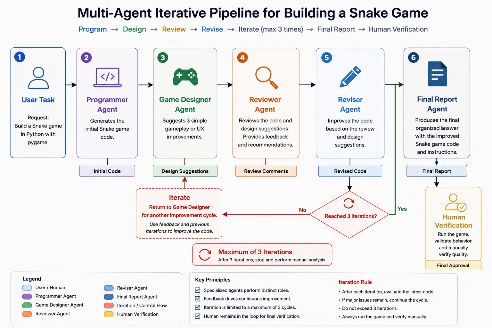

## Learning Goals

By the end of this lab, you should be able to:

- Explain what an AI agent is in the context of Google ADK
- Distinguish between a single-agent workflow and a multi-agent workflow
- Create a basic ADK project in Python
- Define specialized agents using names, descriptions, and instructions
- Build a programmer-designer-reviewer agent team
- Run the agent team from the terminal or the ADK web interface
- Generate a small interactive Python game with `pygame`
- Critically assess the limits of automated code generation, automated design suggestions, and automated review

-----------------------------------

## What is an Agent?

-----------------------------------

In this lab, an **agent** is a model-driven component designed to perform a specific role inside a larger workflow. It combines a language model with explicit instructions that define its responsibilities, expected behavior, and interaction style.

This is different from using a model as a simple chatbot. A chatbot usually responds directly to the user’s latest message. An agent is designed to operate as part of a task-oriented process: it has a role, receives an objective, produces an intermediate result, and may collaborate with other agents.

In our workflow, an agent can be understood through five basic capabilities:

- **Perception**: receiving the user’s task or another agent’s output;
- **Reasoning**: analyzing what needs to be done;
- **Planning**: deciding how to structure the code, review, or tests;
- **Action**: producing code or feedback;
- **Reflection**: using review to improve previous outputs.

The three main agents in this lab have different responsibilities:

- The **Programmer Agent** writes and revises the Snake game code.
- The **Game Designer Agent** suggests simple gameplay and user-experience improvements.
- The **Reviewer Agent** evaluates the code and identifies weaknesses.

If a single model is asked to write, improve, and critique its own code, it may fail to detect its own mistakes.

-----------------------------------

## What is a Multi-Agent System?

-----------------------------------

A **multi-agent system** is a system in which several agents collaborate to complete a task that is too broad or too complex to be handled cleanly by a single role.

The key idea is not simply to use several model calls. The important design principle is **specialization**. Each agent is responsible for one part of the workflow, and the coordinator organizes how their outputs are combined.

In this lab:

- the **Programmer Agent** focuses on producing the first working implementation;
- the **Game Designer Agent** focuses on gameplay and user-experience improvements;
- the **Reviewer Agent** focuses on critique, correctness, maintainability, and hidden bugs;
- the **Reviser Agent** improves the code using the design suggestions and review comments;
- the **Loop Orchestrator** repeats the improvement sequence up to three times.


This structure mirrors a simplified software-engineering workflow (without unit tests). In a real development team, code is rarely considered complete immediately after it is written. It is discussed, reviewed, improved, and manually checked.


-----------------------------------

## Agentic AI vs. Generative AI

-----------------------------------

Generative AI and agentic AI are closely related, but they are not the same.

**Generative AI** focuses primarily on creating content: text, code, explanations, summaries, or other outputs. In a simple code-generation task, a model receives a prompt and produces a block of code.

**Agentic AI** uses generative models inside a broader workflow. The model is used not only to generate content, but also to participate in a sequence of task-oriented steps: analyzing a request, producing an intermediate result, suggesting improvements, reviewing the code, revising it, and preparing a final output.

In this lab, the difference is visible in the structure of the workflow:

```text
Generative AI:
Prompt → Code

Agentic AI:
Prompt → Initial code → Design suggestions → Review → Revised code → Iteration → Human verification
```

The second workflow is more complex, but it is also more transparent. You can inspect each stage and ask whether the design suggestions improved the game, whether the reviewer added value, whether the programmer addressed the feedback, and whether additional iterations actually improved the result.

-----------------------------------

## Lab Walkthrough

-----------------------------------

In this lab, we will build a small agentic software-development workflow.

The system is intentionally limited in scope: it does not replace a professional development environment, and it does not guarantee correct code. Its purpose is pedagogical. It allows us to observe how role specialization can structure a complex generation task.

In this lab, we will:

In this lab, we will:

1. Install Google ADK.
2. Create a new ADK agent project.
3. Define a Programmer Agent.
4. Add a Reviewer Agent and a Reviser Agent.
5. Add a Game Designer Agent.
6. Add a Loop Orchestrator that repeats the improvement cycle.
7. Run the system locally with ADK.
8. Use the agent team to generate a Snake game.
9. Compare how the game changes after each new agent is added.
10. Run the final game manually and inspect its behavior.

-----------------------------------

## Step 1: Prepare an API Key

-----------------------------------

Before starting the lab, you need to create a Google AI Studio API key.

1. Go to [Google AI Studio](https://aistudio.google.com/api-keys).
2. Select the same Google Cloud project that you usually use for the course labs.
3. Click **Get API key** and create a new API key.
4. If Google asks you to verify your age or validate your account, complete the required process.
5. Once the API key has been created, copy it and keep it temporarily in a safe place, such as a local notepad. You will need it later in the lab.

Important: after closing the page, you may not be able to display the same API key again. If you lose it, create a new one.

-----------------------------------

## Step 2: Install Google ADK

-----------------------------------

Install Google ADK:

```bash
pip install google-adk
```

You can verify the installation with:

To test it, use this command, then open the local URL shown in the terminal.

```bash
adk web --port 8000
```
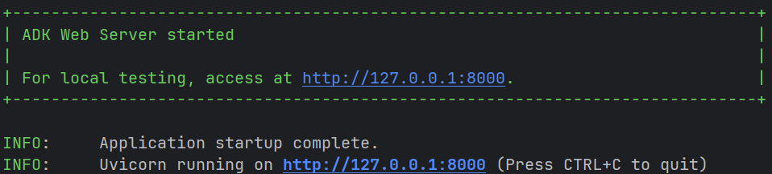
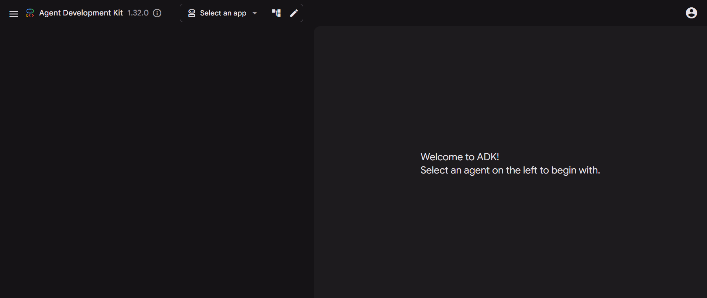
-----------------------------------

## Step 3: Create an ADK Project

-----------------------------------

1. Create a new ADK project:

```bash
adk create code_review_team
```
2. Choose model 1 (gemini-2.5-flash)
3. Select Google AI
4. Paste your API KEY previously created


This creates a folder similar to:

```bash
code_review_team/
├── agent.py
├── .env
└── __init__.py
```

The file `agent.py` contains the main agent definition. In ADK, the main exported object is usually called:

```python
root_agent
```

This is the agent that ADK will run when you use the command line or the web interface.

-----------------------------------

## Step 4: Build the Agent Team Step by Step

-----------------------------------

In this lab, we do not start directly with the final multi-agent system. Instead, we build it progressively.

This is important because it allows us to observe what each new agent adds to the workflow. A single programmer agent can generate a first version of the Snake game. A reviewer agent can then identify weaknesses. A reviser agent can use the review to improve the code. Finally, a game designer agent can suggest simple gameplay improvements.

The objective is to compare the behavior of the system after each step.

For pedagogical reasons, in this lab you will orchestrate the different agents in a sequential order. The objective is to demonstrate how an agentic pipeline can improve your final results. However, it is entirely possible to define an orchestrator agent responsible for selecting which specialized agent to call depending on the task. For example, in the case of our game, depending on the bug identified, it would be possible to invoke the programming and testing agents, and potentially adapt the game design accordingly.

Instead of starting directly with the final orchestration, we first create a simple agent that generates a Snake game. Then, step by step, we add new roles: a reviewer, a reviser, a test writer, a game designer, and finally a loop orchestrator.

This progression is important because it allows you to observe what each agent adds to the workflow.

The final workflow will be:
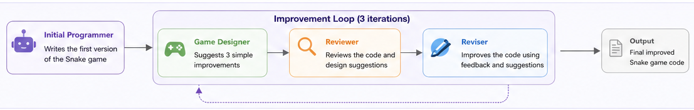


-----------------------------------

### Step 4.1: Start with a Single Programmer Agent

-----------------------------------

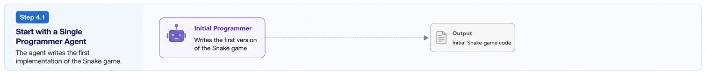

We begin with the simplest possible version: one agent that writes the first version of the Snake game.

At this stage, there is no review, no test generation, and no iteration. The system behaves like a standard code-generation assistant.

install pygame

```bash 
pip install pygame
```

Copy the following code into `code_review_team/agent.py`:

```python
from google.adk.agents import LlmAgent


GLOBAL_MODEL = "gemini-2.5-flash-lite"


root_agent = LlmAgent(
    name="snake_programmer_agent",
    model=GLOBAL_MODEL,
    description="Writes the first implementation of a Snake game.",
    instruction="""
You are a careful Python programmer.

Write a Python Snake game using pygame.

Requirements:
- Create a playable Snake game.
- Use pygame for rendering and keyboard input.
- Display a snake moving on a grid.
- Allow the player to control the snake with the arrow keys.
- Place food at a random position.
- Make the snake grow when it eats food.
- Increase the score when food is eaten.
- End the game when the snake hits the wall or itself.
- Display the current score.
- Show a game-over message.
- Allow the player to restart after losing.
- Keep the implementation simple enough to run as a single Python file.

Return only the Python code.
""",
)
```

Make sure that you run ADK from the root folder of the lab, not from inside the `code_review_team` folder.

You can start run the web interface through:

```bash
adk web --port 8000
```

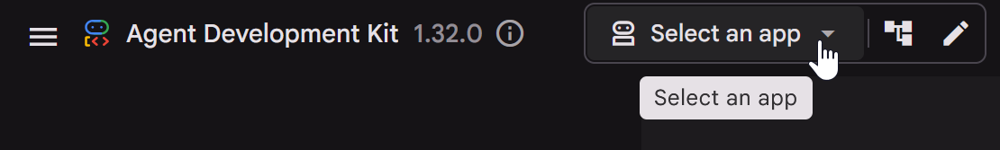


For each step, reuse the following prompt and observe the result:


```text
Create a Python Snake game using pygame.

The game should:
1. open a game window;
2. display a snake moving on a grid;
3. allow the player to control the snake with the arrow keys;
4. place food at a random position on the grid;
5. make the snake grow when it eats food;
6. increase the score when food is eaten;
7. end the game when the snake hits the wall or itself;
8. display the current score;
9. show a game-over message;
10. allow the player to restart the game after losing.

The code should be modular and readable.

Important design requirement:
Separate the game logic from the pygame rendering as much as possible.


Do not ask the model to use the full workflow in the prompt. The workflow is already defined in `agent.py`.
```

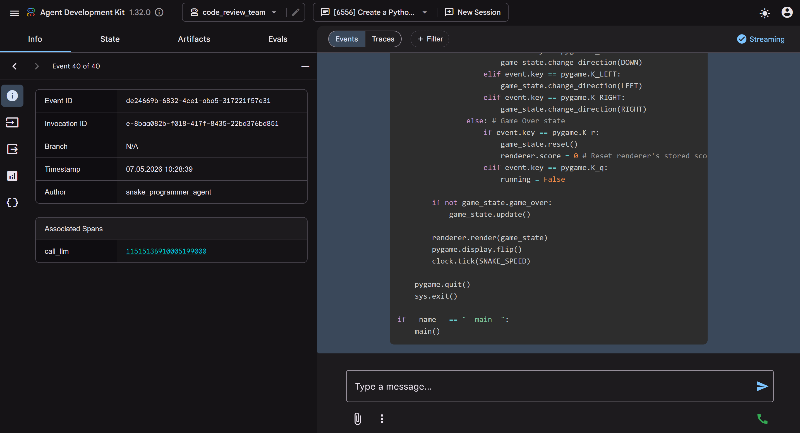

This first version may produce a playable game, but it has not been reviewed.

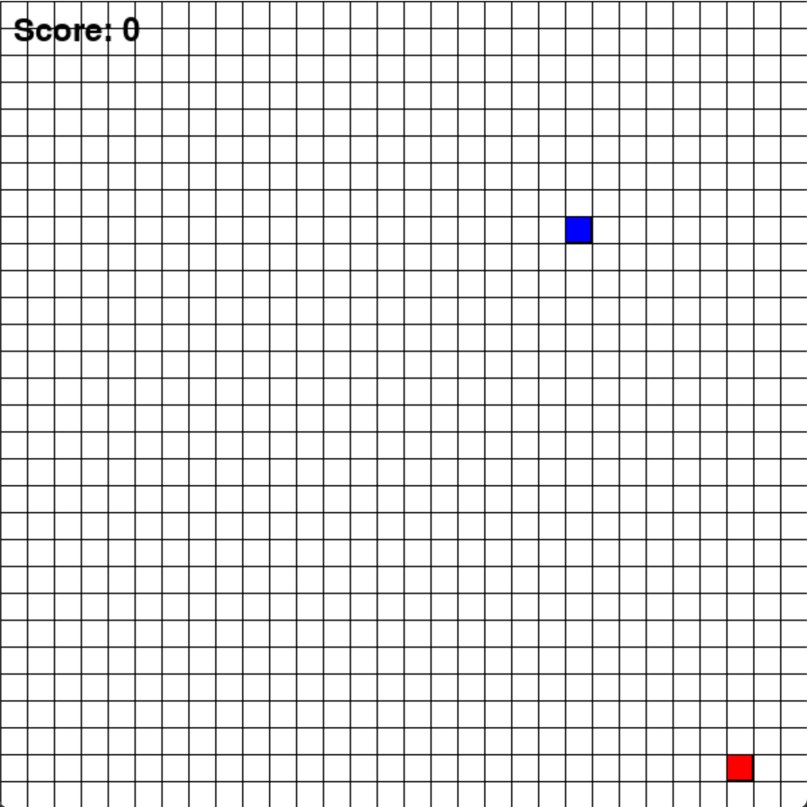

If you're experiencing issues because the model is exhausted or you've used up your free credits, you can switch to a different model. For example, you can try the non-lite version of Gemini or the latest.

After each modification of `agent.py`, start a new session in the ADK web interface. This avoids mixing outputs from different versions of the agent workflow.

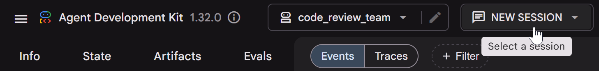
-----------------------------------

### Step 4.2: Add a Reviewer and a Reviser

-----------------------------------

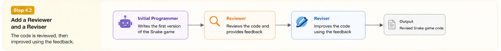

We now add two roles:

- **Reviewer Agent**, which analyzes the generated code;
- **Reviser Agent**, which improves the code using the reviewer’s feedback.

This version introduces a basic software-engineering workflow:

```text
Programmer → Reviewer → Reviser
```

replace your previous agent.py by the following code:

```python
from google.adk.agents import LlmAgent, SequentialAgent


GLOBAL_MODEL = "gemini-2.5-flash-lite"


initial_programmer_agent = LlmAgent(
    name="initial_programmer_agent",
    model=GLOBAL_MODEL,
    description="Writes the first implementation of the Snake game.",
    instruction="""
You are a careful Python programmer.

Write the first version of a Python Snake game using pygame.

Requirements:
- Create a playable Snake game.
- Use pygame for rendering and keyboard input.
- Display a snake moving on a grid.
- Allow the player to control the snake with the arrow keys.
- Place food at a random position.
- Make the snake grow when it eats food.
- Increase the score when food is eaten.
- End the game when the snake hits the wall or itself.
- Display the current score.
- Show a game-over message.
- Allow the player to restart after losing.
- Keep the implementation simple enough to run as a single Python file.
- Return only the Python code.
""",
    output_key="current_code",
)


reviewer_agent = LlmAgent(
    name="reviewer_agent",
    model=GLOBAL_MODEL,
    description="Reviews the current Snake implementation.",
    instruction="""
You are a strict but constructive Python code reviewer.

Review the following Snake game implementation:

{current_code}

Focus on:
- correctness;
- collision detection;
- food placement;
- restart logic;
- game-state management;
- readability;
- unnecessary complexity;
- separation between game logic and pygame rendering.

Return a structured review with:
Summary:
Major issues:
Minor issues:
Concrete recommendations:

Do not rewrite the full code.
""",
    output_key="review_comments",
)


reviser_agent = LlmAgent(
    name="reviser_agent",
    model=GLOBAL_MODEL,
    description="Revises the Snake implementation using reviewer feedback.",
    instruction="""
You are a careful Python programmer.

Revise the current Snake game implementation using the review comments.

Current code:
{current_code}

Review comments:
{review_comments}

Return the improved Snake game code only.

Requirements:
- Keep the game playable with pygame.
- Keep the implementation as a single Python file.
- Keep the code modular and readable.
- Address the reviewer comments.
- Avoid unnecessary complexity.
""",
    output_key="current_code",
)


root_agent = SequentialAgent(
    name="snake_review_pipeline",
    sub_agents=[
        initial_programmer_agent,
        reviewer_agent,
        reviser_agent,
    ],
)
```

Run the same Snake prompt again.

Compare this version with the previous one. The output should now include a review step and a revised version of the game.

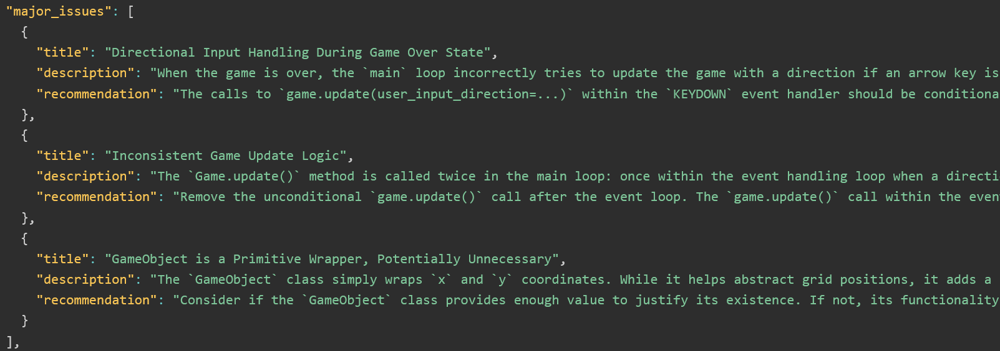


-----------------------------------

### Step 4.3: Add a Game Designer Agent

-----------------------------------

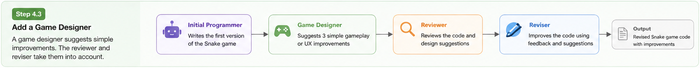

We now add a **Game Designer Agent**.

This agent does not write code. Its role is to suggest simple gameplay or user-experience improvements. The reviewer and reviser then consider these suggestions when improving the game.

This shows that agents do not all need to be programmers. Some agents can contribute design, critique, verification, or planning.


Copy the following code into `code_review_team/agent.py`:

```python
from google.adk.agents import LlmAgent, SequentialAgent


GLOBAL_MODEL = "gemini-2.5-flash-lite"


initial_programmer_agent = LlmAgent(
    name="initial_programmer_agent",
    model=GLOBAL_MODEL,
    description="Writes the first implementation of the Snake game.",
    instruction="""
You are a careful Python programmer.

Write the first version of a Python Snake game using pygame.

Requirements:
- Create a playable Snake game.
- Use pygame for rendering and keyboard input.
- Separate game logic from rendering as much as possible.
- Use functions or classes to make the code readable and testable.
- Include score, food placement, wall collision, self-collision, game over, and restart.
- Keep the implementation simple enough to run as a single Python file.
- Return only the Python code.
""",
    output_key="current_code",
)


game_designer_agent = LlmAgent(
    name="game_designer_agent",
    model=GLOBAL_MODEL,
    description="Suggests simple gameplay or user-experience improvements for the Snake game.",
    instruction="""
You are a game designer.

Your task is to suggest simple improvements for the current Snake game.

Current Snake game implementation:
{current_code}

Suggest exactly three improvements.

The improvements must be:
- easy to implement in a single Python file;
- useful for gameplay or user experience;
- also simple graphic adjustments;
- not too complex;
- compatible with a simple pygame Snake game.

Good examples:
- add a start screen with controls;
- add difficulty levels;
- increase speed when the score increases;
- add a pause and resume feature;
- add a high score for the current session;
- improve the game-over screen;
- improve colors and readability.

Do not write code.

Return the suggestions in this exact structure:
GAME DESIGN SUGGESTIONS

1. Improvement name:
Short description:
Why it improves the game:

2. Improvement name:
Short description:
Why it improves the game:

3. Improvement name:
Short description:
Why it improves the game:
""",
    output_key="game_design_suggestions",
)


reviewer_agent = LlmAgent(
    name="reviewer_agent",
    model=GLOBAL_MODEL,
    description="Reviews the current Snake implementation.",
    instruction="""
You are a strict but constructive Python code reviewer.

Review the current Snake implementation:

{current_code}

Also consider these game design suggestions:

{game_design_suggestions}

Focus on:
- correctness;
- collision detection;
- food placement;
- restart logic;
- game-state management;
- separation between game logic and pygame rendering;
- testability;
- readability;
- whether the game design suggestions are reasonable and simple enough.

Return a structured review with:
Summary:
Major issues:
Minor issues:
Game design feedback:
Concrete recommendations:

Do not rewrite the full code.
""",
    output_key="review_comments",
)


reviser_agent = LlmAgent(
    name="reviser_agent",
    model=GLOBAL_MODEL,
    description="Revises the current Snake implementation using reviewer and game designer feedback.",
    instruction="""
You are a careful Python programmer.

Revise the current Snake game implementation using the review comments and game design suggestions.

Current code:
{current_code}

Review comments:
{review_comments}

Game design suggestions:
{game_design_suggestions}

Return the improved Snake game code only.

Requirements:
- Keep the game playable with pygame.
- Keep the implementation as a single Python file.
- Keep the code modular and readable.
- Improve testability by separating deterministic game logic from rendering.
- Address the reviewer comments.
- Implement the game design suggestions only if they remain simple and do not make the code too complex.
- Avoid unnecessary complexity.
""",
    output_key="current_code",
)


root_agent = SequentialAgent(
    name="snake_design_pipeline",
    sub_agents=[
        initial_programmer_agent,
        game_designer_agent,
        reviewer_agent,
        reviser_agent,
    ],
)
```

Now compare the output with the previous version. The result should not only be reviewed and revised, but also improved from a gameplay or user-experience perspective, such this case with visual feedback.

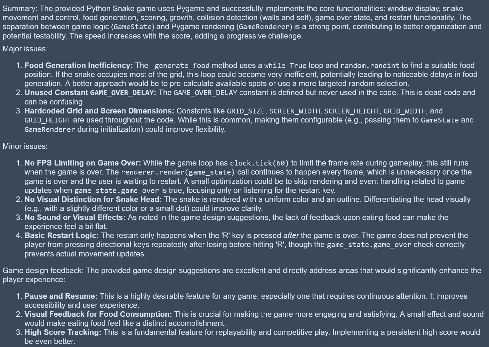
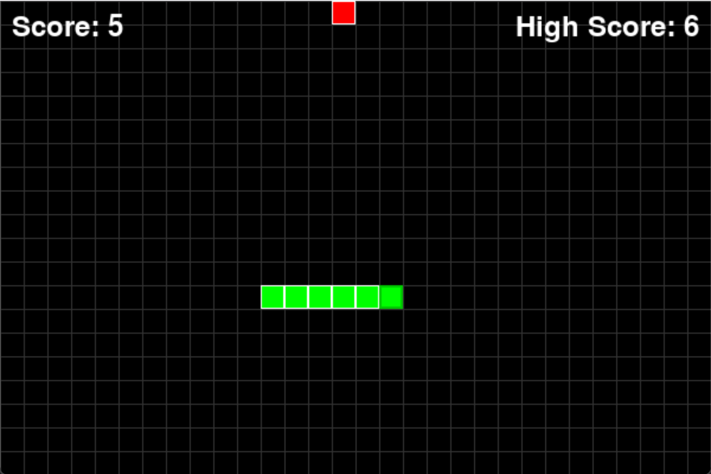
-----------------------------------

### Step 4.4: Add the Loop Orchestrator

-----------------------------------

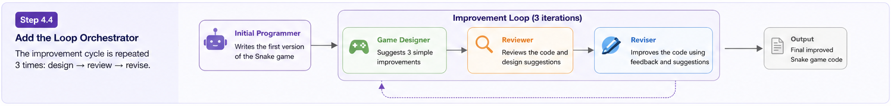

Finally, we add a `LoopAgent`.

The loop repeats the improvement sequence three times:

```text
Game Designer → Reviewer → Reviser
```

This produces a more agentic workflow because the code is not improved only once. It goes through several design, review, and revision cycles.

Copy the following code into `code_review_team/agent.py`:

```python
from google.adk.agents import LlmAgent, SequentialAgent, LoopAgent


GLOBAL_MODEL = "gemini-2.5-flash-lite"


initial_programmer_agent = LlmAgent(
    name="initial_programmer_agent",
    model=GLOBAL_MODEL,
    description="Writes the first implementation of the Snake game.",
    instruction="""
You are a careful Python programmer.

Write the first version of a Python Snake game using pygame.

Requirements:
- Create a playable Snake game.
- Use pygame for rendering and keyboard input.
- Separate game logic from rendering as much as possible.
- Use functions or classes to make the code readable and testable.
- Include score, food placement, wall collision, self-collision, game over, and restart.
- Keep the implementation simple enough to run as a single Python file.
- Return only the Python code.
""",
    output_key="current_code",
)


game_designer_agent = LlmAgent(
    name="game_designer_agent",
    model=GLOBAL_MODEL,
    description="Suggests simple gameplay or user-experience improvements for the Snake game.",
    instruction="""
You are a game designer.

Your task is to suggest simple improvements for the current Snake game.

Current Snake game implementation:
{current_code}

Suggest exactly three improvements.

The improvements must be:
- easy to implement in a single Python file;
- also simple graphic adjustments;
- useful for gameplay or user experience;
- not too complex;
- compatible with a simple pygame Snake game.

Good examples:
- add a start screen with controls;
- add difficulty levels;
- increase speed when the score increases;
- add a pause and resume feature;
- add a high score for the current session;
- improve the game-over screen;
- improve colors and readability.

If the game already contains enough features, do not propose major new ones. Instead, suggest small refinements that improve clarity, usability, or player experience without increasing complexity.

Do not write code.

Return the suggestions in this exact structure:
GAME DESIGN SUGGESTIONS

1. Improvement name:
Short description:
Why it improves the game:

2. Improvement name:
Short description:
Why it improves the game:

3. Improvement name:
Short description:
Why it improves the game:
""",
    output_key="game_design_suggestions",
)


reviewer_agent = LlmAgent(
    name="reviewer_agent",
    model=GLOBAL_MODEL,
    description="Reviews the current Snake implementation.",
    instruction="""
You are a strict but constructive Python code reviewer.

Review the current Snake implementation:

{current_code}

Also consider these game design suggestions:

{game_design_suggestions}

Focus on:
- correctness;
- collision detection;
- food placement;
- restart logic;
- game-state management;
- separation between game logic and pygame rendering;
- testability;
- readability;
- whether the game design suggestions are reasonable and simple enough.

Return a structured review with:
Summary:
Major issues:
Minor issues:
Game design feedback:
Concrete recommendations:

Do not rewrite the full code.
""",
    output_key="review_comments",
)


reviser_agent = LlmAgent(
    name="reviser_agent",
    model=GLOBAL_MODEL,
    description="Revises the current Snake implementation using reviewer and game designer feedback.",
    instruction="""
You are a careful Python programmer.

Revise the current Snake game implementation using the review comments and game design suggestions.

Current code:
{current_code}

Review comments:
{review_comments}

Game design suggestions:
{game_design_suggestions}

Return the improved Snake game code only.

Requirements:
- Keep the game playable with pygame.
- Keep the implementation as a single Python file.
- Keep the code modular and readable.
- Improve testability by separating deterministic game logic from rendering.
- Address the reviewer comments.
- Implement the game design suggestions only if they remain simple and do not make the code too complex.
- Avoid unnecessary complexity.
""",
    output_key="current_code",
)

game_improvement_loop = LoopAgent(
    name="game_improvement_loop",
    max_iterations=3,
    sub_agents=[
        game_designer_agent,
        reviewer_agent,
        reviser_agent,
    ],
)


final_report_agent = LlmAgent(
    name="final_report_agent",
    model=GLOBAL_MODEL,
    description="Produces the final organized answer for the student.",
    instruction="""
You are preparing the final output for a student.

Use the latest available code, game design suggestions, and review comments.

Final Snake game code:
{current_code}

Latest game design suggestions:
{game_design_suggestions}

Latest review comments:
{review_comments}

Return the final answer with exactly these sections:

FINAL SNAKE GAME CODE

Paste the final Python code here.

NOTES

Briefly explain:
- that the code went through three game-design-review-revision iterations;
- which game design suggestions were implemented;
""",
)


root_agent = SequentialAgent(
    name="snake_game_orchestrator",
    sub_agents=[
        initial_programmer_agent,
        game_improvement_loop,
        final_report_agent,
    ],
)
```

The loop agent improves the game through several controlled iterations. Each iteration can introduce small design refinements, review the current implementation, and revise the code. Typical improvements may include clearer visuals, better controls, a more informative game-over screen, or gameplay changes such as increasing the snake speed when food is eaten.

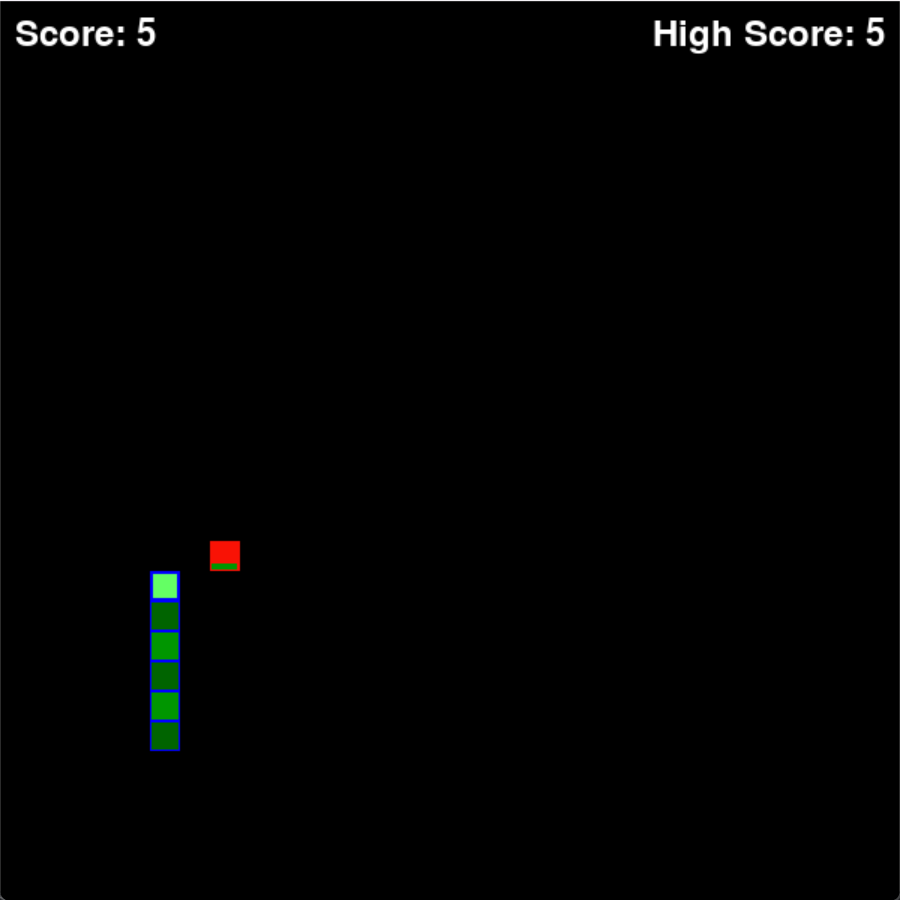
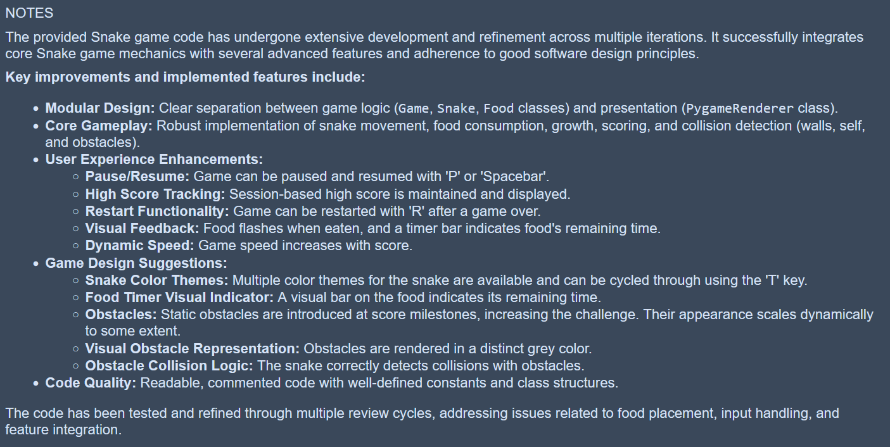


-----------------------------------

## Additional Notes

-----------------------------------

### Multi-agent does not mean automatically better

A multi-agent system can improve a result by introducing specialization, review, and testing. However, it can also introduce new problems: longer outputs, unnecessary complexity, inconsistent agent behavior, or false confidence.

The purpose of this lab is therefore not to assume that more agents always produce better results. The purpose is to examine whether a structured workflow helps produce code that is easier to understand, review, test, and improve.

### Why use a reviewer agent?

The reviewer agent creates a structured critique step. This makes the process more transparent because students can inspect the review and verify whether the final version actually addresses the identified issues.

A useful reviewer should not only say that the code is “good” or “bad”. It should identify concrete problems, such as:

- food being placed inside the snake;
- collision detection missing edge cases;
- restart logic not resetting the full game state;
- game logic being too tightly coupled with `pygame` rendering;
- code being difficult to test.

### Why keep a human in the loop?

Agentic workflows can structure and accelerate software-development tasks, but they do not remove the need for human judgment. Generated code can still contain bugs, security problems, inefficient logic, or incorrect assumptions.

Human verification remains essential, especially when the system produces executable code. In this lab, you should run the game, inspect the code, and decide whether the final result is actually better than the initial one.

