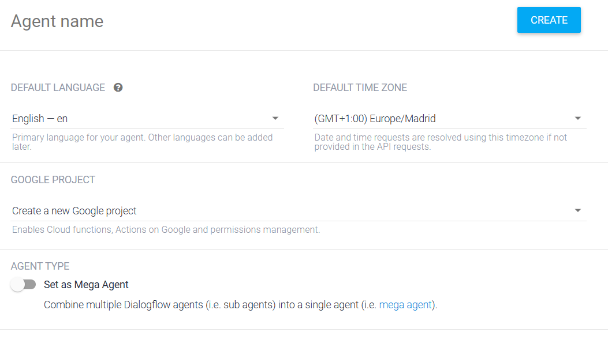
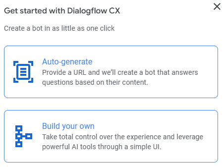
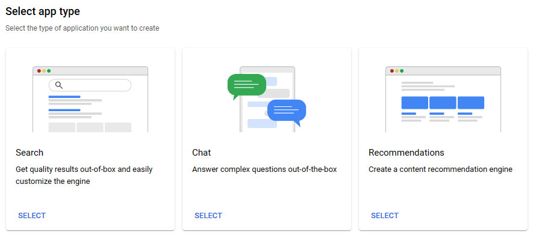
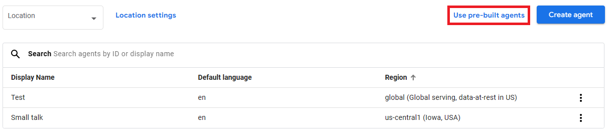
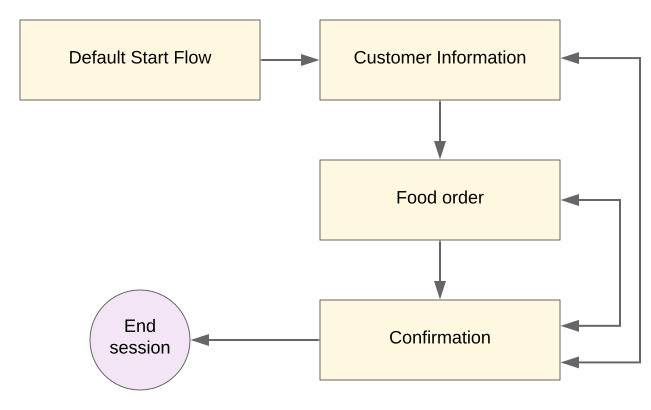
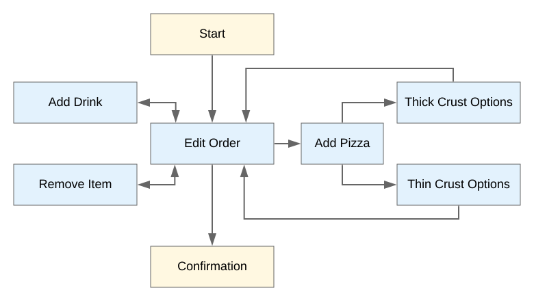
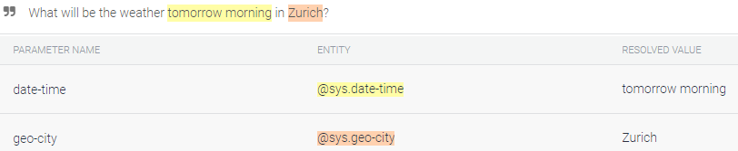
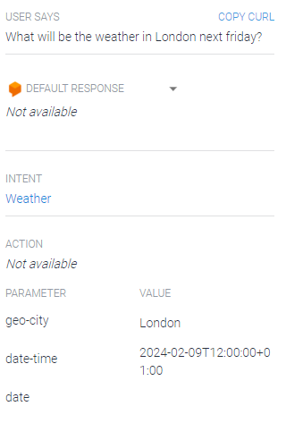

# Content
This is a guide to building Chatbots with Google Cloud Platform. 
Here is the summary of its content:
* [What is a Chatbot?](#what-is-a-chatbot)
    * [What is Dialogflow](#what-is-dialogflow)
* [Implement a Chatbot in GCP](#implement-a-chatbot-in-gcp)
    * [Implement with Dialog ES](#implement-with-dialog-es)
        * [Adding intent](#adding-intent)
        * [Your turn](#your-turn)
    * [Implement with Dialog CX](#implement-with-dialog-cx)
        * [Auto-generate an agent](#auto-generate-an-agent)
        * [Build your own agent](#build-your-own-agent)
            * [Flows](#flows)
            * [Pages](#pages)
* [Your turn](#your-turn-1)

# [What is a Chatbot?](#what-is-a-chatbot)

Chatbots are conversational agents that simulate conversation with users. They're designed to understand and respond to user inputs, assist with tasks, answer questions, and conversationally provide information.

Google Cloud Platform (GCP) allows us to use its AI to build such chatbots. We will use the Dialogflow platform, which is an easy-to-use and powerful tool. 

## [What is Dialogflow](#what-is-dialogflow)

Dialogflow is a natural language understanding (NLU) platform that simplifies the design and integration of conversational user interfaces into mobile apps, online applications, gadgets, bots, interactive voice response systems, and so on. It understands the user's numerous inputs in voice and text formats.

# [Implement a Chatbot in GCP](#implement-a-chatbot-in-gcp)

Dialogflow facilitates two different virtual agents' services with their own type, API, user interface, client libraries, and documentation. These two are: [Dialogflow ES](https://dialogflow.cloud.google.com/#/getStarted) and [Dialogflow CX](https://dialogflow.cloud.google.com/cx/).

The ES is for the standard agent type and is suitable for small agents and the CX is an advanced version of it and handles complex agents.

## [Implement with Dialog ES](#implement-with-dialog-es)

Go to the [console](https://dialogflow.cloud.google.com) and enable the API. Then create your first agent by choosing the name, the language, and the time zone. You can also link it to a project to reuse functions that have been created in the project. If you need more details, you can read the [documentation](https://cloud.google.com/dialogflow/es/docs?hl=en)

You can also import an agent that is in the data folder as an example. 

### [Adding intent](#adding-intent)

Then, an intent must be created. An intent categorizes an end-user's intention for one conversation turn. For each agent, you define many intents, where your combined intents can handle a complete conversation. When an end-user writes or says something, referred to as an end-user expression, Dialogflow matches the end-user expression to the best intent in your agent. Matching an intent is also known as intent classification. You can read more about intent [here](https://cloud.google.com/dialogflow/es/docs/intents-overview?hl=en).

On the right side panel, you can try to interact with your agent. Try to ask `What is your name?`. Since we haven't yet specified an intent, the agent is confused and doesn't know what to answer. 

Now, click on the plus to add an intent. Give a name to the intent and go to the training phrases section. Add these sentences `What is your name?`, `Tell me your name`, and `Do you have a name?`. Then, go to the answers and add `My name is Dialogflow!` as the answer. Save the intent and then ask again for the name of the agent. It should give you the previous answer. Try to reformulate the question. You can see that sometimes the agent understands the question and sometimes not. The more questions you add to the training intent, the more accurate the agent will be.

More features can be implemented to the agent and pre-build agents also exist. You can also use the agent through the API. 

### [Your turn](#your-turn)
Try to play with the pre-built agents and create an agent that answers questions about Machine Learning questions. 

## [Implement with Dialog CX](#implement-with-dialog-cx)

Now, let's try to do the same with CX. Click on `Create agent`. You have two options:

Let's first try with Auto-generate

### [Auto-generate an agent](#auto-generate-an-agent)

Once you click on auto-generate, it will redirect you to the Vertex AI. Select the `Chat` option. 

Configure the agent by giving it your organization name, the time zone, the language, and the name. Note that providing your company name helps the model provide higher-quality responses.

Then, give the data source to the model. You can choose different types of sources: websites, BigQuery, Cloud Storage, or the API. Note that when you give a URL, you must be the owner of the website in order to train the agent.

Your agent is almost ready, we need now to create the flow of the diagram. We will for that come back to building our own agent. 

### [Build your own agent](#build-your-own-agent)

Go back to the main view of the console and select your project. Then click on use pre-built agents:

Here you have a variety of agents, you can play with them to better understand how agents are built. We will use the *Small talk* agent. 

You land on the page of the flow. In the top right corner, you can test your agent. Open the panel and say `Hi` to the agent. It gives you a small description of the agent. Try to chat with it and see the results.

#### [Flows](#flows)
In the left panel, you have the flows. Flows are used to define these topics and the associated conversational paths. Every agent has one flow called the Default Start Flow. This single flow may be all you need for a simple agent. More complicated agents may require additional flows, and different development team members can be responsible for building and maintaining these flows. 

As an example, we will look at the flows of a pizza delivery agent.

#### [Pages](#pages)
On the main window, you see the pages. Pages are the states that define the conversation. For each flow, you define many pages, where your combined pages can handle a complete conversation on the topics the flow is designed for. At any given moment, exactly one page is the current page, the current page is considered active, and the flow associated with that page is considered active. Every flow has a special start page. When a flow initially becomes active, the start page becomes the current page. For each conversational turn, the current page will either stay the same or transition to another page.

You configure each page to collect information from the end-user that is relevant to the conversational state represented by the page. For example, you might create the pages (in blue) in the diagram below for a `Food Order` flow of a pizza delivery agent. The Start node of the diagram represents the start page of the Food Order flow. When the flow is complete, it transitions to the Confirmation flow.

#### [Entity types](#entity-types)
Entity types are used to control how data from end-user input is extracted. CX entity types are very similar to ES entity types.
Dialogflow provides predefined system entities that can match many common types of data. For example, there are system entities for matching dates, times, colors, email addresses, and so on. You can also create your own custom entities for matching custom data. For example, you could define a vegetable entity that can match the types of vegetables available for purchase with a grocery store agent.

#### [Parameters](#parameters)
Parameters are used to capture and reference values that have been supplied by the end-user during a session. Each parameter has a name and an entity type. Unlike raw end-user input, parameters are structured data that can easily be used to perform some logic or generate responses.
CX parameters are similar to ES parameters, but the utility and scope have been expanded, and the syntax to reference parameters has changed.

#### [Forms](#forms)
For each page, you can define a form, which is a list of parameters that should be collected from the end-user for the page. The agent interacts with the end-user for multiple conversation turns until it has collected all of the required form parameters, which are also known as page parameters. The agent collects these parameters in the order defined on the page. For each required form parameter, you also provide prompts that the agent uses to request that information from the end-user. This process is called form filling.

For example, you might create a form that collects the end-user's name and telephone number for a Collect Customer Info page.

CX form filling is similar to ES slot filling.

#### [State handlers](#state-handlers)

State handlers, also simply called handlers, are used to control the conversation by creating responses for end-users and/or by transitioning the current page. For each conversational turn, handlers are evaluated and may affect the session.

There are two types of state handlers with differing handler requirements:
* **Routes** are called when an end-user input matches an intent and/or some condition on the session status is met. A route with an intent requirement is also called an intent route. A route with only a condition requirement is also called a condition route.
* **Event handlers** are called when an event is invoked. Some built-in events are triggered when unexpected end-user input is received, or when a webhook error occurs. You can also define custom events that you invoke when something happens outside the conversation.

## [Example](#example)

For this example, we will create a small chatbot that gives you the meteo of a given city. 

First, go on the Dialog ES console and create a new intent. In the training phrases, add some phrases of someone who wants to know the weather in a specific region. For example, `What will` be the weather tomorrow morning in Zurich?`. Once you press enter, the system will automatically understand where are the parameters. It should detect the date, the time, and the city. 

Remember that the more phrases you add, the more precise your chatbot will be.

Now, save your intent and try it in the upper right corner. Let's say that you want to know the weather in London next Friday. Simply ask the agent and see how it answers. 

Here you can see that there are no answers because we haven't told yet how the bot should answer. However, we can see which parameter it has extracted from the question. The bot understood that the city was London and got the correct date. 

Finally, to integrate your chatbot, click on fulfillment and enable the inline editor. It will give you the Google Cloud Function for your Node.js code. In our example, here is the code:

~~~~javascript
// See https://github.com/dialogflow/dialogflow-fulfillment-nodejs
// for Dialogflow fulfillment library docs, samples, and to report issues
'use strict';
 
const functions = require('firebase-functions');
const {WebhookClient} = require('dialogflow-fulfillment');
const {Card, Suggestion} = require('dialogflow-fulfillment');
 
process.env.DEBUG = 'dialogflow:debug'; // enables lib debugging statements
 
exports.dialogflowFirebaseFulfillment = functions.https.onRequest((request, response) => {
  const agent = new WebhookClient({ request, response });
  console.log('Dialogflow Request headers: ' + JSON.stringify(request.headers));
  console.log('Dialogflow Request body: ' + JSON.stringify(request.body));
 
  function welcome(agent) {
    agent.add(`Welcome to my agent!`);
  }
 
  function fallback(agent) {
    agent.add(`I didn't understand`);
    agent.add(`I'm sorry, can you try again?`);
  }

  // // Uncomment and edit to make your own intent handler
  // // uncomment `intentMap.set('your intent name here', yourFunctionHandler);`
  // // below to get this function to be run when a Dialogflow intent is matched
  // function yourFunctionHandler(agent) {
  //   agent.add(`This message is from Dialogflow's Cloud Functions for Firebase editor!`);
  //   agent.add(new Card({
  //       title: `Title: this is a card title`,
  //       imageUrl: 'https://developers.google.com/actions/images/badges/XPM_BADGING_GoogleAssistant_VER.png',
  //       text: `This is the body text of a card.  You can even use line\n  breaks and emoji! 💁`,
  //       buttonText: 'This is a button',
  //       buttonUrl: 'https://assistant.google.com/'
  //     })
  //   );
  //   agent.add(new Suggestion(`Quick Reply`));
  //   agent.add(new Suggestion(`Suggestion`));
  //   agent.setContext({ name: 'weather', lifespan: 2, parameters: { city: 'Rome' }});
  // }

  // // Uncomment and edit to make your own Google Assistant intent handler
  // // uncomment `intentMap.set('your intent name here', googleAssistantHandler);`
  // // below to get this function to be run when a Dialogflow intent is matched
  // function googleAssistantHandler(agent) {
  //   let conv = agent.conv(); // Get Actions on Google library conv instance
  //   conv.ask('Hello from the Actions on Google client library!') // Use Actions on Google library
  //   agent.add(conv); // Add Actions on Google library responses to your agent's response
  // }
  // // See https://github.com/dialogflow/fulfillment-actions-library-nodejs
  // // for a complete Dialogflow fulfillment library Actions on Google client library v2 integration sample

  // Run the proper function handler based on the matched Dialogflow intent name
  let intentMap = new Map();
  intentMap.set('Default Welcome Intent', welcome);
  intentMap.set('Default Fallback Intent', fallback);
  // intentMap.set('your intent name here', yourFunctionHandler);
  // intentMap.set('your intent name here', googleAssistantHandler);
  agent.handleRequest(intentMap);
});
~~~~

# [Your turn](#your-turn-1)

Create a new agent that can help a pizza delivery system. Think of how you would order a pizza on the phone and think of all the possible cases. 
