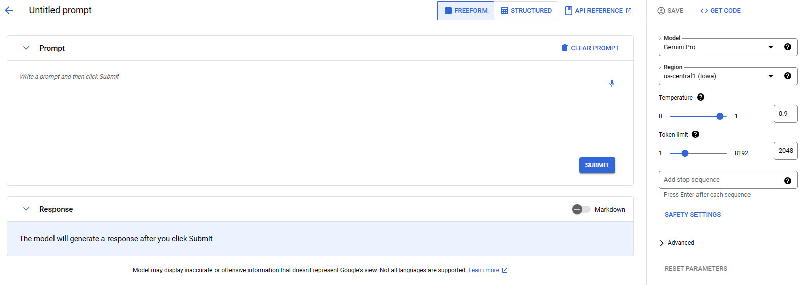

# Content

This markdown is an introduction to GenAI studio from Google. It is based on [this course](https://www.cloudskillsboost.google/course_templates/552?locale=en). 

This is a summary of the content:
* [What is Generative AI?](#what-is-generative-ai)
	* [How does GenAI generate content?](#how-generate-content)
* [What is Generative AI Studio?](#generative-ai-studio)
	* [How to use GenAI studio?](#how-gen-ai-studio)
		* [Language](#language)
			* [Promp design](#prompt-design)
			* [Conversation design](#conversation-design)
			* [Fine-tuning](#fine-tuning)
		* [Vision](#vision)
			* [Generate images](#generate-images)
			* [Captioning](#captioning)
			* [Visual Q&A](#visual-qa)
		* [Speech](#speech)
			* [Text-to-speech](#text-to-speech)
			* [Speech-to-text](#speech-to-text) 
	* [Pricing](#pricing)
	* [Text Embeddings](#text-embeddings)
* [Your turn](#your-turn)

# [What is Generative AI?](#what-is-generative-ai)

[Generative AI](https://en.wikipedia.org/wiki/Generative_artificial_intelligence) (or GenAI) is a type of artificial intelligence that generates content for you.

The generated content can be from different types. For example:

*   Text
*   Code
*   Images
*   Speech
*   Video
*   3D models
*   And many more

GenAI can help you in various tasks such as document summarization, information extraction, code generation, virtual assistance, ...

## [How does GenAI generate content?](#how-generate-content)

GenAI is trained on a large dataset with different data types to generate generalized content. The model can be improved by re-training it with a new dataset to produce more specific content. 

# [What is Generative AI Studio?](#generative-ai-studio)

It is a tool developed by Google that allows people to use *Machine Learning as a Service* (MLaaS) very easily. It is easy to use and implement for your application. 

## [How to use GenAI studio?](#how-gen-ai-studio)
GenAI studio can be used in many different ways. We will focus on language, vision, and speech. 

### [Language](#language)

First, let's have a look at language processing. Log into your Google account and to your [Google Cloud console](https://console.cloud.google.com). Then go to the [Vertex AI](https://console.cloud.google.com/vertex-ai) product. 
Here you can choose between a lot of products from Google and its AI. 

#### [Promp design](#prompt-design)
We will first try to generate a text based on a prompt just like you would use ChatGPT. Select Language on the left tab, and then choose *TEXT PROMPT*.

You should arrive on this page:

Here you can type your prompt and get an answer. You can also play with the parameters of the model or change the model. 

##### Temperature
Temperature controls the degree of randomness in token selection. Lower temperatures are good for prompts that expect a true or correct response, while higher temperatures can lead to more diverse or unexpected results. With a temperature of 0 the highest probability token is always selected.

##### Token limit
Token limit determines the maximum amount of text output from one prompt. A token is approximately four characters.

##### Top-K
Top-k changes how the model selects tokens for output. A top-k of 1 means the selected token is the most probable among all tokens in the model's vocabulary (also called greedy decoding), while a top-k of 3 means that the next token is selected from among the 3 most probable tokens (using temperature).

##### Top-P
Top-p changes how the model selects tokens for output. Tokens are selected from most probable to least until the sum of their probabilities equals the top-p value. For example, if tokens A, B, and C have a probability of .3, .2, and .1 and the top-p value is .5, then the model will select either A or B as the next token (using temperature).

There are different ways of prompting:
* Zero-shot prompting:  Providing a single command to the model without any example.
* One-shot prompting: Providing a single example of the task to the model. 
* Few-shot prompting: Providing a few examples of the task to the model. 

To perform one-shot and few-shot prompting, click on the upper-right case *STRUCTURED*. 

You can input here your example to fine-tune the model on how you want it to respond. 

####   [Conversation design](#conversation-design)

Now, let's have a look at conversation design. Click on *TEXT CHAT* on the language menu. It is the same principle as chatGPT, but you can go further by playing with the parameters on the right. 

####   [Fine-tuning](#fine-tuning)

Finally, we can play with fine-tuning the LLM in order to have better-generated content. 

First, click on *TUNE AND DISTILL*, and select *CREATE TUNE MODEL*.

Enter the different model details such as name, base model, region, and the output directory. 
Then, add a [JSON Lines](https://jsonlines.org/) file that contains the input and expected output of your model. You can find an example of such a dataset [here](data/peft_train_sample.jsonl). Some rules have to be taken into account when creating these datasets. You can have more information on the [documentation](https://cloud.google.com/vertex-ai/docs/generative-ai/models/tune-text-models-supervised?authuser=1&hl=en#prepare_a_supervised_tuning_dataset).

### [Vision](#vision)

In the vision side of GenAI Studio, the features are limited to image creation, image captioning, and image Q&A. 

####   [Generate images](#generate-images)

This feature is not yet available to everyone. 

####   [Captioning](#captioning)

This feature allows you to generate a description of the given image. 

####   [Visual Q&A](#visual-qa)

With this function, you can upload an image and ask the AI some questions about the picture. 

### [Speech](#speech)

The speech feature of GenAI Studio is also quite limited. 

####   [Text-to-speech](#text-to-speech)

This feature allows you to generate a speech based on a given text. It is only available in English and Spanish. You can play with the speed and the female/male sound of the speech. 

####   [Speech-to-text](#speech-to-text)

Here you can give the model an audio and it will try to transcribe it. Several languages are available. 

## [Pricing](#pricing)
Now, all these operations have a cost. When you first sign up for GCP, you have 300$ included to try the platform, so don't spend all of them at once. 

To approximate the costs of real-case use of the platform, Google has developed a price calculator that you can find [here](https://cloud.google.com/products/calculator?hl=en). You can choose which model you are using and specify how you will use it. It will then give you an approximate price per month for your application. 

## [Text Embeddings](#text-embeddings)
To go further, you can directly get the embedding of text and multimodal data. You cand have a look a the documentation [here](https://cloud.google.com/vertex-ai/docs/generative-ai/embeddings/get-text-embeddings?hl=en)

In Python, you can use this code to get an embedding of a text. 

~~~~python
from vertexai.language_models import TextEmbeddingModel

def text_embedding() -> list:
    """Text embedding with a Large Language Model."""
    model = TextEmbeddingModel.from_pretrained("textembedding-gecko@001")
    embeddings = model.get_embeddings(["What is life?"])
    for embedding in embeddings:
        vector = embedding.values
        print(f"Length of Embedding Vector: {len(vector)}")
    return vector

if __name__ == "__main__":
    text_embedding()
~~~~

For multimodal applications, you will need to [install Google Cloud CLI](https://cloud.google.com/vertex-ai/docs/generative-ai/embeddings/get-multimodal-embeddings?hl=en#prereqs).

Then in Python, you will just need to specify where your image file and your text are and give the ID of your project. You can run the following command in your terminal to retrieve the embeddings. 

~~~~python
python3 predict_request_gapic.py \
  --image_file 'IMAGE_FILE' \
  --text 'TEXT' \
  --project "PROJECT_ID"
~~~~

# [Your turn](#your-turn)

The goal is for you to play with the different features of GenAI Studio, to see its possibilities and its limitations. There are no right or wrong answers in this section. 

Here are some exercises you can try:

* Try to predict the difficulty of [these sentences](/data/unlabelled_test_data.txt) by fine-tuning a model with different examples of difficulty (you can use this [small dataset](/data/training_data.txt)). Does it seem accurate to you?

* Take a screenshot of one of your lectures' slides and ask some questions so that the GenAI can explain to you clearly its content. 

* Record yourself by reading a small text and give it to the AI. Is the result accurate?

* Try to integrate the API into a Python notebook.

* Compute the cost of an application that generates a daily summary (~300 characters) of all journal articles that have been printed during the day (~15 articles/day, one article ~ 1000 characters).
