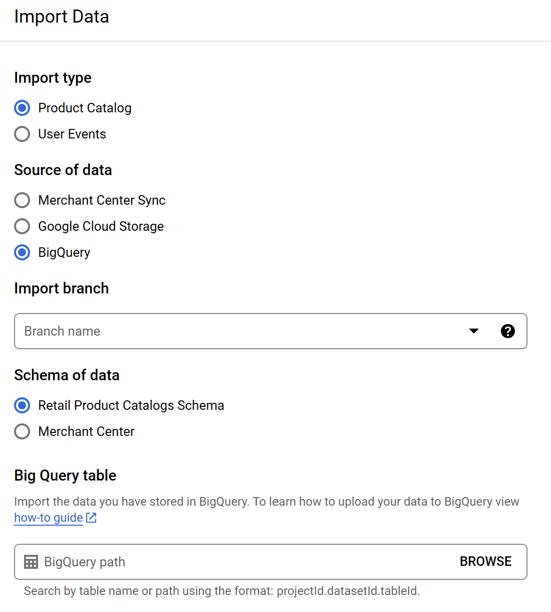

# Content

This lab focuses on building a recommender system by using Google Cloud AI. It has been based on this [article](https://towardsdatascience.com/build-a-recommender-system-using-google-cloud-c0929f0c3080).

The content is the following:

* [Why using Google Cloud Recommendation AI?](#why-using-google-cloud-recommendation-ai)
    * [Personalization in GCRAI](#personalization-in-gcrai)
* [How to Implement Google Cloud Recommendation AI?](#how-to-implement-google-cloud-recommendation-ai)
    * [Prerequisites](#prerequisites)
    * [Import product details](#import-product-details)
    * [Import historical events](#import-historical-events)
    * [Send real-time events](#send-real-time-events)
    * [BiqQuerry data](#biqquerry-data)
* [Your turn](#your-turn)

# [Why using Google Cloud Recommendation AI?](#why-using-google-cloud-recommendation-ai)

Google Cloud Recommendation AI (GCRAI) is a powerful tool when it comes to recommender systems. It allows you to use recommendation systems that are used for YouTube or Google Ads for example. 

Here are some benefits of using GCRAI: 
* Time and cost saving: CRAI is an easy tool to use for your system. 
* High-performing recommendations: GCRAI is supposed to deliver better conversion rates and customer satisfaction. 
* Scalability: GCRAI can handle large amounts of data and can easily be scalable with your system. 

## [Personalization in GCRAI](#personalization-in-gcrai)

GCRAI uses machine learning to deliver a feeling of personalization of the recommender to the user. For example, it can:

1. Personalized Recommendations: Implement a “Just for you” or “Recommended for you” section on the homepage, providing tailored suggestions based on individual user preferences and behavior.
2. Item Recommendations: Display an “Others you may like” section on the product detail page, recommending items that are highly likely to engage or be purchased by the user.
3. Cart Recommendations: Utilize a “Frequently bought together” section to suggest additional products that are commonly purchased alongside the selected item, thereby enhancing the user’s shopping experience.
4. Similar Item Recommendations: Present a “Similar items” section on the product page, showcasing items with similar attributes to the one being viewed, particularly useful when the viewed item is out of stock.
Repeat Purchase Recommendations: Implement a “Buy it again” feature across different pages (e.g., homepage, product detail, the cart) to suggest items that users are likely to repurchase based on their previous interactions.
5. Sales Recommendations: Utilize an “On sale” section to showcase discounted items, encouraging users to explore and make purchases.

# [How to Implement Google Cloud Recommendation AI?](#how-to-implement-google-cloud-recommendation-ai)

## [Prerequisites](#prerequisites)

Some prerequisites are needed. You will need to:
* Have a project created. 
* Have the BigQuery API activated. 
* Have a public dataset. See [this guide](https://cloud.google.com/bigquery/docs/quickstarts/query-public-dataset-console?hl=en#open_a_public_dataset) to get one. We will use the [Google Trends dataset](https://console.cloud.google.com/marketplace/product/bigquery-public-datasets/google-search-trends).
* Have some data about products and events. You can have a look at this [notebook](https://github.com/GoogleCloudPlatform/analytics-componentized-patterns/blob/master/retail/recommendation-system/bqml/bqml_retail_recommendation_system.ipynb) if needed. 

Now, let's dive into the implementation of a recommender system. Go to the [Recommendation AI page](https://console.cloud.google.com/ai/retail/catalogs/default_catalog/dashboard) on the Google Cloud console. You should arrive on the retail dashboard.

The recommender system will need two things to make recommendations. User activities and product details.

* User activities are the actions made by the users related to the products. For example, it can be an `add to cart` action, a `view shopping cart` action, or a `search catalog` one. 
* Product details are attributes that define the products. It can be an ID, a name, a title, and many more. 

## [Import product details](#import-product-details)

First, let's load the product details of your catalog. Click on the `IMPORT PRODUCT CATALOG` (red box on the picture). Then you can choose which type of data you want to import. Select `Product Catalog` and then choose the source of data.

! Be aware that the data should follow a strict format. The dataset must contain the following attributes: `id`, `name`, `title`, and `categories`. You can find more information about the attributes of a product in the [documentation](https://cloud.google.com/retail/docs/reference/rest/v2/projects.locations.catalogs.branches.products).

If you want to use BigQuery to import your data, a specific schema is used. You can find more information [here](https://cloud.google.com/retail/docs/catalog?hl=en#schema).

Once you have filled out all the forms, you can import your data and visualize it. 

## [Import historical events](#import-historical-events)

Next, we need to give historical events to the model. It can be imported by clicking on `IMPORT USER EVENTS` (green box). 

Again, this dataset needs to follow a strict schema that you can find [here](https://cloud.google.com/retail/docs/user-events#bigquery_6).

This step is optional but will give you better results as the model will be more trained. 

## [Send real-time events](#send-real-time-events)

//TODO

## [BiqQuerry data](#biqquerry-data)

This part is for people who don't already have a dataset and who want to try to build a recommender system with a public one. This tutorial comes from [here](https://medium.com/google-cloud/how-to-build-a-recommendation-system-on-e-commerce-data-using-bigquery-ml-df9af2b8c110) 

 Use the following code to import the public dataset and replace the `bigquery-public-data.google_analytics_sample.ga_sessions_2016*` line with the ID of your public dataset. This can be found by doing a right click on `bigquerry-public-data > google_analytics_sample > ga_sessions_`. 

~~~~sql
CREATE OR REPLACE TABLE bqml.aggregate_web_stats AS (
  WITH
    durations AS (
      --calculate pageview durations
      SELECT
        CONCAT(fullVisitorID,'-', 
             CAST(visitNumber AS STRING),'-', 
             CAST(hitNumber AS STRING) ) AS visitorId_session_hit,
        LEAD(time, 1) OVER (
          PARTITION BY CONCAT(fullVisitorID,'-',CAST(visitNumber AS STRING))
          ORDER BY
          time ASC ) - time AS pageview_duration
      FROM
        `bigquery-public-data.google_analytics_sample.ga_sessions_2016*`,
        UNNEST(hits) AS hit 
    ),
      
    prodview_durations AS (
      --filter for product detail pages only
      SELECT
        CONCAT(fullVisitorID,'-',CAST(visitNumber AS STRING)) AS visitorId,
        productSKU AS itemId,
        IFNULL(dur.pageview_duration,
          1) AS pageview_duration,
      FROM
        `bigquery-public-data.google_analytics_sample.ga_sessions_2016*` t,
        UNNEST(hits) AS hits,
        UNNEST(hits.product) AS hits_product
      JOIN
        durations dur
      ON
        CONCAT(fullVisitorID,'-',
               CAST(visitNumber AS STRING),'-',
               CAST(hitNumber AS STRING)) = dur.visitorId_session_hit
      WHERE
      #action_type: Product detail views = 2
      eCommerceAction.action_type = "2" 
    ),
    
    aggregate_web_stats AS(
      --sum pageview durations by visitorId, itemId
      SELECT
        visitorId,
        itemId,
        SUM(pageview_duration) AS session_duration
      FROM
        prodview_durations
      GROUP BY
        visitorId,
        itemId )
    SELECT
      *
    FROM
      aggregate_web_stats
);
~~~~

Then create the matrix with this code:

~~~~sql
CREATE OR REPLACE MODEL bqml.retail_recommender
OPTIONS(model_type='matrix_factorization', 
        user_col='visitorId', 
        item_col='itemId',
        rating_col='session_duration',
        feedback_type='implicit'
        )
AS
SELECT * FROM bqml.aggregate_web_stats
~~~~

To make a prediction, you can use the following code. It gives us the top 5 items you should recommend to a specific user. 

~~~~sql
DECLARE MY_VISITORID STRING DEFAULT "0824461277962362623-1";
SELECT
  *
FROM
  ML.RECOMMEND(MODEL `bqml.retail_recommender`,
      (SELECT MY_VISITORID as visitorID)
              )
ORDER BY predicted_session_duration_confidence DESC
LIMIT 5
~~~~

And if you want to see the names of the product, use this code (don't forget to replace the right BigQuerry link):

~~~~sql
DECLARE
  MY_VISITORID STRING DEFAULT "6499749315992064304-2";
WITH
  product_details AS(
  SELECT
    productSKU,
    v2ProductName,
  FROM
    `bigquery-public-data.google_analytics_sample.ga_sessions_2016*`,
    UNNEST(hits) AS hits,
    UNNEST(hits.product) AS hits_product
  GROUP BY
    2,
    1 )
SELECT
  r.*,
  d.v2ProductName
FROM
  ML.RECOMMEND(MODEL `bqml.retail_recommender`,
    (
    SELECT
      MY_VISITORID AS visitorId)) r
JOIN
  product_details d
ON
  r.itemId = d.productSKU
ORDER BY
  predicted_session_duration_confidence DESC
LIMIT
  5
~~~~

Now, to output the best recommendations for all the users, use this code:

~~~~sql
-- Create output table of top 5 predictions
CREATE OR REPLACE TABLE bqml.prod_recommendations AS (
WITH predictions AS (
    SELECT 
      visitorId, 
      ARRAY_AGG(STRUCT(itemId, 
                       predicted_session_duration_confidence)
                ORDER BY 
                  predicted_session_duration_confidence DESC
                LIMIT 5) as recommended
    FROM ML.RECOMMEND(MODEL bqml.retail_recommender)
    GROUP BY visitorId
)
SELECT
  visitorId,
  itemId,
  predicted_session_duration_confidence
FROM
  predictions p,
  UNNEST(recommended)
);
-- Show table
SELECT
  *
FROM
  bqml.prod_recommendations
ORDER BY 
  visitorId
LIMIT
  10
~~~~

# [Your turn](#your-turn)

Try to create your own dataset from public ones, import the products and the events and try to create a new model. 

